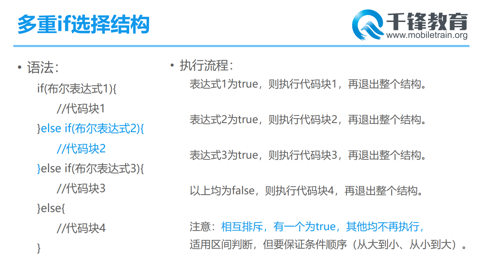

# Day 04笔记

## 一、三元运算符

* 也称为三元表达式
* 有三个元素参与运算
* 会得到一个结果

```java
class Demo02 {
	public static void main(String[] args) {
		/*
			三元运算符
				布尔表达式 ? 结果1 : 结果2;

				如果布尔表达式的结果是true
					得到的是结果1
				如果布尔表达式的结果是false
					得到的是结果2
				表达式返回值的类型和结果类型相关
				结果的类型必须是兼容的
				
		*/
		int a = 33;
		int b = 55;
		int max = a>b ? a:b;
		System.out.println("max = " + max);

		String result = a > b ? "a大" : b;
		System.out.println(result);

	}
}
```

## 二、位运算（熟悉）

* 使用二进制位运算的方式

```java
class Demo03 {
	public static void main(String[] args) {
		/*
			1 === true
			0 === false
			  0000 1010
			| 0000 1111
			===========
			  0000 1111
		*/
		System.out.println(10 | 15);

		/*
			1 === true
			0 === false

			  0000 1010
			& 0000 1111
			===========
			  0000 1010 == 10
		*/
		System.out.println(10 & 15);

		/*
			异或
			1 === true
			0 === false

			  0000 1010
			^ 0000 1111
			===========
			  0000 0101 == 5
		*/
		System.out.println(10 ^ 15);

		System.out.println(10 >> 1);

		System.out.println(10 << 1);
		
	}
}
```

## 三、人机交互--键盘录入

### 3.1 概述

* 有些时候我们需动态的写入数据
* 可以使用键盘录入的方式
* 核心API
  * Scanner
  * next()读取一个单词
  * nextInt()读取一个整数
  * nextFloat()读取一个float数据
  * nextDouble()
  * nextBolean()
  * nextLine()

### 3.2 键盘录入初体验

```java
import java.util.Scanner;	// 1、导入Scanner这个类
class Demo04 {
	public static void main(String[] args) {
		/*
			键盘录入一个数字,判断是不是偶数、

			1、导入Scanner这个类
			2、创建Scanner对象
			3、提示用户输入数字
			4、获取用户输入的数字
			5、判断数字输出结果
		*/

		int a = 10;
		// 2、创建Scanner对象
		Scanner sc = new Scanner(System.in);
		
		// 3、提示用户输入数字
		System.out.println("请输入一个整数:");

		// 4、获取用户输入的数字
		int num = sc.nextInt();

		// 5、判断数字输出结果
		String result = num%2==0 ? "偶数" : "奇数";
		System.out.println("您输入这个整数是" + result);

	}
}
```

### 3.3 键盘录入各种类型的数据

```java
import java.util.Scanner; //1、导入Scanner--键盘
class Demo05{
	public static void main(String[] args) {
		/*
			键盘录入姓名、年龄、地址、备注等信息，在控制台输出
			
			代码思路
				1、导入Scanner--键盘
				2、创建Scanner对象
				3、提示输入姓名
				4、获取姓名
				5、提示输入年龄
				6、获取年龄
				7、提示输入地址
				8、获取地址
				9、提示输入备注
				10、获取备注
				11、输出以上信息
		*/

		// 2、创建Scanner对象
		Scanner sc = new Scanner(System.in);

		// 3、提示输入姓名
		// 4、获取姓名
		System.out.println("请输入你的名字:");
		String name = sc.next();

		// 5、提示输入年龄
		// 6、获取年龄
		System.out.println("请输入你的年龄:");
		int age = sc.nextInt();

		// 7、提示输入地址
		// 8、获取地址
		System.out.println("请输入你的地址:");
		String address = sc.next();

		// 9、提示输入备注
		// 10、获取备注
		System.out.println("请输入你的备注信息:");
		String info = sc.next();

		System.out.println("我是:" + name + ",今年:" + age + ",来自:" + address + ",备注:" + info);

	}
}
```

### 3.4 获取较大的数字

```java
import java.util.Scanner;
class Demo06 {
	public static void main(String[] args) {
		/*
			键盘录入3个数字,输出最大的

			代码思路
				1、导包
				2、创建键盘对象
				3、提示输入第一个数字
				4、获取输入的第一个数字
				... ...
				9、比较

		*/
		Scanner sc = new Scanner(System.in);
		System.out.println("请输入第一个数字:");
		int a = sc.nextInt();
	
		System.out.println("请输入第二个数字:");
		int b = sc.nextInt();

		System.out.println("请输入第三个数字:");
		int c = sc.nextInt();

		// 获取a和b中较大的
		int max;
		max = a>b ? a:b;

		// 获取max和c中较大的
		max = max>c ? max:c;

		System.out.println("三个数字最大的是:" + max);

	}
}
```

* 键盘录入三角形的边长，计算三角形的周长
* 键盘录入身高和体重，判断BMI是否正常

## 四、选择结构--if

### 4.1 概述

* 代码执行的时候可能根据不同条件执行对应的代码
* 可以使用选择结构实现

### 4.2 语法

```
if(布尔表达式){
	满足条件执行的代码
}
后续代码

如果布尔表达式结果为true，执行if中的代码，再执行后续代码
如果布尔表达式结果为false，跳过if中的代码，执行后续代码
```

```java
class Demo07 {
	public static void main(String[] args) {
		/*
			如果(工资>15000){选他}

			如果(不用努力了){选他}

			如果(铁饭碗&待遇好){选他}

			if(条件--布尔值){条件成立执行}
		*/

		/*
			找工作--12000
		*/

		int salary = 1300;

		// 如果(工资>=12000){干了}
		if(salary >= 12000){
			System.out.println("这个可以干...");
		}

		System.out.println("Hello World!");
	}
}
```

```java
import java.util.Scanner;
class Demo08 {
	public static void main(String[] args) {
		/*
			键盘录入你的身高,如果大于162可以参与征兵
		*/

		Scanner sc = new Scanner(System.in);

		System.out.println("请输入你的身高:");

		int height = sc.nextInt();

		if(height >= 162){
			System.out.println("欢迎参加征兵工作,请先填写个人信息:");
		}

		System.out.println("OVER");

	}
}
```

## 五、选择结构--if...else

### 5.1 语法

```
if(布尔表达式){
	满足条件执行
}else{
	不满足条件执行
}
后续代码

如果布尔表达式为true，执行if后面的代码块，再执行后续代码
如果布尔表达式为false，执行else后面的代码块，再执行后续代码
```

### 5.2 检票案例

```
import java.util.Scanner;
class Demo09 {
	public static void main(String[] args) {
		/*
			模拟车站检票
				如果有车票，提示进站安检
				如果没有车票，提示去买票
			
			1、导包
			2、参加键盘对象
			3、提示出示车票
			4、获取车票信息(有==1，无==0)
			5、判断是否能进站
		*/
		Scanner sc = new Scanner(System.in);
		System.out.println("请出示车票(有票==1,无票==0)：");

		int ticket = sc.nextInt();

		// 判断
		if(ticket>0){
			System.out.println("检票通过,请排队安检...");
		} else{
			System.out.println("请先去购买车票...");
		}

		System.out.println("OVER");
	}
}
```

* 键盘录入一个年份，判断这个年份是不是闰年
* 键盘录入一个三位数整数，判断是不是水仙花数字

### 5.3 三角形周长

```java
import java.util.Scanner;
class Demo10 {
	public static void main(String[] args) {
		// 键盘录入三角形的边长，计算三角形的周长
		/*
			分析
				1、导包
				2、创建Scanner对象
				3、提示输入第一条边长
				4、获取第一条边长
				... ...
				9、判断能不能构成三角形，计算周长
		*/

		Scanner sc = new Scanner(System.in);

		System.out.println("请输入第一条边长:");
		int a = sc.nextInt();

		System.out.println("请输入第二条边长:");
		int b = sc.nextInt();

		System.out.println("请输入第三条边长:");
		int c = sc.nextInt();

		// 判断能不能构成三角形
		if((a+b>c) && (a+c>b) && (b+c>a)){
			System.out.println("周长是:" + (a+b+c));
		}else{
			System.out.println("您输入三条边长无法构成三角形");
		}

		System.out.println("OVER");
	}
}
```

### 5.4 判断水仙花数字

```java
import java.util.Scanner;
class Demo11 {
	public static void main(String[] args) {
		// 键盘录入一个三位数整数，判断是不是水仙花数字

		/*
			1、导包
			2、创建Scanner对象
			3、提示输入一个3位整数数字
			4、获取这个数字
			5、把数字拆分为个位、十位、百位
			6、获取各位数字的立方和
			7、判断是不是水仙花数字
			8、输出结果
		*/
		Scanner sc = new Scanner(System.in);
		System.out.println("请输入一个三位数整数:");

		int num = sc.nextInt();

		// 5、把数字拆分为个位、十位、百位
		/*
			153  --- 
				百位
					153/100
				十位
					153/10%10
				个位
					153%10
		*/
		int g = num%10;
		int s = num/10%10;
		int b = num/100;

		int sum = g*g*g + s*s*s + b*b*b;

		// 7、判断是不是水仙花数字
		if(sum == num){
			System.out.println(num + "是一个水仙花数字...");
		}else{
			System.out.println(num + "NO是一个水仙花数字...");
		}
		System.out.println("OVER");
	}
}
```

### 5.5 查询课程

```java
import java.util.*;
class Demo12 {
	public static void main(String[] args) {
		/*
			键盘录入星期几，输出这一天的课程
			思路
				1、导包
				2、创建Scanner对象
				3、提示输入星期几--整数
				4、获取这个日期
				5、根据日期输出课程
		*/
		Scanner sc = new Scanner(System.in);

		System.out.println("请输入你要查星期几的课程(1--7):");
		int day = sc.nextInt();

		// 判断
		if(day == 1){
			System.out.println("今天是星期一,课程有体育,艺术,影视鉴赏");
		}

		if(day == 2){
			System.out.println("今天是星期二,课程有语文,思想品德");
		}

		if(day == 3){
			System.out.println("今天是星期三,课程有中国近代史,大学英语");
		}

		if(day == 4){
			System.out.println("今天是星期四,课程有高等数学,C语言");
		}

		if(day == 5){
			System.out.println("今天是星期五,课程有Python,数据结构");
		}

		if(day == 6){
			System.out.println("今天是星期六,课程有CS");
		}

		if(day == 7){
			System.out.println("今天是星期日,课程有LOL");
		}

		if(day<1 || day>7){
			System.out.println("时间不存在...");
		}
		System.out.println("查询结束");
	}
}
```

## 六、选择结构--多重if

### 6.1 语法

```
if(条件01){
	代码块01
} else if(条件02){
	代码块02
} else if(条件03){
	代码块03
} else if(条件04){
	代码块04
}...{
	
}else{
	代码块N
}
```



### 6.2 课程表案例

```java
import java.util.*;
class Demo13{
	public static void main(String[] args) {
		/*
			键盘录入星期几，输出这一天的课程
			思路
				1、导包
				2、创建Scanner对象
				3、提示输入星期几--整数
				4、获取这个日期
				5、根据日期输出课程
		*/
		Scanner sc = new Scanner(System.in);

		System.out.println("请输入你要查星期几的课程(1--7):");
		int day = sc.nextInt();

		// 判断
		if(day == 1){
			System.out.println("今天是星期一,课程有体育,艺术,影视鉴赏");
		} else if(day == 2){
			System.out.println("今天是星期二,课程有语文,思想品德");
		} else if(day == 2){
			System.out.println("今天是星期二,课程有语文,思想品德===");
		} else if(day == 2){
			System.out.println("今天是星期二,课程有语文,思想品德****");
		} else if(day == 3){
			System.out.println("今天是星期三,课程有中国近代史,大学英语");
		} else if(day == 4){
			System.out.println("今天是星期四,课程有高等数学,C语言");
		} else if(day == 5){
			System.out.println("今天是星期五,课程有Python,数据结构");
		} else if(day == 6){
			System.out.println("今天是星期六,课程有CS");
		} else if(day == 7){
			System.out.println("今天是星期日,课程有LOL");
		} else{
			System.out.println("日期不存在。。。。。。。。。。。。。");
		}

		System.out.println("Hello World!");
	}
}
```

* 键盘录入月份，输出这个月份对应的季节和季节特征

### 6.3 月份和季节

```java
import java.util.Scanner;
class Demo14 {
	public static void main(String[] args) {
		// 键盘录入月份，输出这个月份对应的季节和季节特征

		/*
			1、导包
			2、创建对象
			3、提示输入
			4、获取数据
			5、判断输出
		*/
		Scanner sc = new Scanner(System.in);

		System.out.println("请输入你喜欢的月份:");
		int month = sc.nextInt();

		// 判断
		if(month==3 || month==4 || month==5){
			System.out.println(month + "月是春节,春暖花开...");
		} else if(month==6 || month==7 || month==8){
			System.out.println(month + "月是夏节,烈日炎炎...");
		} else if(month==9 || month==10 || month==11){
			System.out.println(month + "月是秋节,秋高气爽...");
		} else if(month==12 || month==1 || month==2){
			System.out.println(month + "月是冬节,北风呼啸...");
		} else{
			System.out.println(month + "月不存在");
		}

		System.out.println("OVER");
	}
}
```

## 七、选择结构--if嵌套

### 7.1 语法

```
if(条件01){
	代码块01
	满足条件01执行
	
	if(条件02){
		代码块03
		满足条件01和02执行
	}else{
		代码块04
		满足条件01，不满足条件02执行
	}
} else{
	代码块02
	不满足条件01执行
}

满足条件01会执行代码块01
不满足条件01.会执行代码块02

满足条件01和条件02，会执行代码块01和代码块03
满足条件01，不满足条件02，会执行代码块01和代码块04
```

### 7.2 乘车案例

```java
import java.util.Scanner;
class Demo15 {
	public static void main(String[] args) {
		/*
			模拟乘坐火车

				检票
					有票
						安检
							通过
								排队候车
							未通过
								带走

					无票
						提示去买票
				
		*/
		Scanner sc = new Scanner(System.in);
		
		// 检票环节
		System.out.println("请出示车票(有票==1,无票==0):");
		int ticket = sc.nextInt();

		// 判断车票
		if(ticket==1){
			System.out.println("检票通过,请进站安检");
			// 安检环节
			System.out.println("您的刀具长度是多多少(mm):");
			int length = sc.nextInt();

			// 判断
			if(length > 150){
				// 管制刀具
				System.out.println("你携带了管制刀具,请跟我走一趟...");
			} else{
				System.out.println("安检通过,请排队候车...");
			}

		} else{
			System.out.println("请先去购买车票...");
		}
	}
}
```

## 八、分支--switch

* 选择结构的另一种实现方式

### 8.1 语法

```
switch(变量名){
	case 值1:
		如果 变量==值1，执行此处代码
		break;
	case 值2:
		如果 变量==值2，执行此处代码
		break;
	... ...
	default:
		case后面的值和变量都不相等,执行这个默认的代码
		break;
}
```

### 8.2 switch风扇转速

```java
import java.util.Scanner;
class Demo17 {
	public static void main(String[] args) {
		// 键盘录风扇档位,输出转速

		/*
			1、导包
			2、创建对象
			3、提示输入
			4、获取数据
			5、判断输出
		*/
		Scanner sc = new Scanner(System.in);

		System.out.println("请输入风扇的档位(0--3):");
		int level = sc.nextInt();

		switch(level){
			case 0:
				// level==0
				System.out.println("现在的档位是0,风扇处于停止状态...");
				break;

			case 1:	// 等同于if(level==1)
				// level==1
				System.out.println("现在的档位是1,风扇转速较慢...");
				break;

			case 2:
				// level==2
				System.out.println("现在的档位是2,风扇转速适中...");
				break;
			
			case 3:
				// level==3
				System.out.println("现在的档位是3,风扇转速很快...");
				break;
			
			default:
				// level没有和以上任意case匹配到
				System.out.println("档位不存在");
				break;
		}
	}
}
```

### 8.3 switch和课程表

```java
import java.util.*;
class Demo18 {
	public static void main(String[] args) {
		/*
			键盘录入星期几，输出这一天的课程
			思路
				1、导包
				2、创建Scanner对象
				3、提示输入星期几--整数
				4、获取这个日期
				5、根据日期输出课程
		*/
		Scanner sc = new Scanner(System.in);

		System.out.println("请输入你要查星期几的课程(1--7):");
		int day = sc.nextInt();

		switch(day){
			case 1:
				System.out.println("今天是星期一,课程有体育,艺术,影视鉴赏");
				break;

			case 2:
				System.out.println("今天是星期2,课程有体育,艺术,影视鉴赏");
				break;

			case 3:
				System.out.println("今天是星期3,课程有体育,艺术,影视鉴赏");
				break;

			case 4:
				System.out.println("今天是星期4,课程有体育,艺术,影视鉴赏");
				break;

			case 5:
				System.out.println("今天是星期5,课程有体育,艺术,影视鉴赏");
				break;

			case 6:
				System.out.println("今天是星期6,课程有体育,艺术,影视鉴赏");
				break;

			case 7:
				System.out.println("今天是星期7,课程有体育,艺术,影视鉴赏");
				break;
			
			default:
				System.out.println("日期有误");
				break;
		}

		System.out.println("Hello World!");
	}
}
```

### 8.4 switch和季节

```java
import java.util.Scanner;
class Demo19 {
	public static void main(String[] args) {
		// 键盘录入月份，输出这个月份对应的季节和季节特征

		/*
			1、导包
			2、创建对象
			3、提示输入
			4、获取数据
			5、判断输出
		*/
		Scanner sc = new Scanner(System.in);

		System.out.println("请输入你喜欢的月份:");
		int month = sc.nextInt();

		switch(month){
			case 1:
				System.out.println(month + "月是冬节,北风呼啸...");
				break;
			case 2:
				System.out.println(month + "月是冬节,北风呼啸...");
				break;
			case 12:
				System.out.println(month + "月是冬节,北风呼啸...");
				break;
			
			case 3:
				System.out.println(month + "月是春节,春暖花开...");
				break;
			case 4:
				System.out.println(month + "月是春节,春暖花开...");
				break;
			case 5:
				System.out.println(month + "月是春节,春暖花开...");
				break;

			case 6:
				System.out.println(month + "月是夏节,烈日炎炎...");
				break;
			case 7:
				System.out.println(month + "月是夏节,烈日炎炎...");
				break;
			case 8:
				System.out.println(month + "月是夏节,烈日炎炎...");
				break;

			case 9:
				System.out.println(month + "月是秋节,秋高气爽...");
				break;
			case 10:
				System.out.println(month + "月是秋节,秋高气爽...");
				break;
			case 11:
				System.out.println(month + "月是秋节,秋高气爽...");
				break;
			
			default:
				System.out.println(month + "月不存在");
				break;
			
		}

		System.out.println("Hello World!");
	}
}
```

### 8.5 switch的特殊情况

* default的位置
  * 可以放在switch任意单元位置
* break缺失
  * case穿透

```java
import java.util.Scanner;
class Demo20 {
	public static void main(String[] args) {
		// 键盘录入月份，输出这个月份对应的季节和季节特征

		/*
			1、导包
			2、创建对象
			3、提示输入
			4、获取数据
			5、判断输出
		*/
		Scanner sc = new Scanner(System.in);

		System.out.println("请输入你喜欢的月份:");
		int month = sc.nextInt();

		switch(month){
			case 1:	
			case 2:
			case 12:
				System.out.println(month + "月是冬节,北风呼啸...");
				break;
			
			case 3:
			case 4:
			case 5:
				System.out.println(month + "月是春节,春暖花开...");
				break;

			case 6:
			case 7:
			case 8:
				System.out.println(month + "月是夏节,烈日炎炎...");
				break;

			case 9:
			case 10:
			case 11:
				System.out.println(month + "月是秋节,秋高气爽...");
				break;

			default:
				System.out.println(month + "月不存在");
				break;
		}

		System.out.println("Hello World!");
	}
}
```

