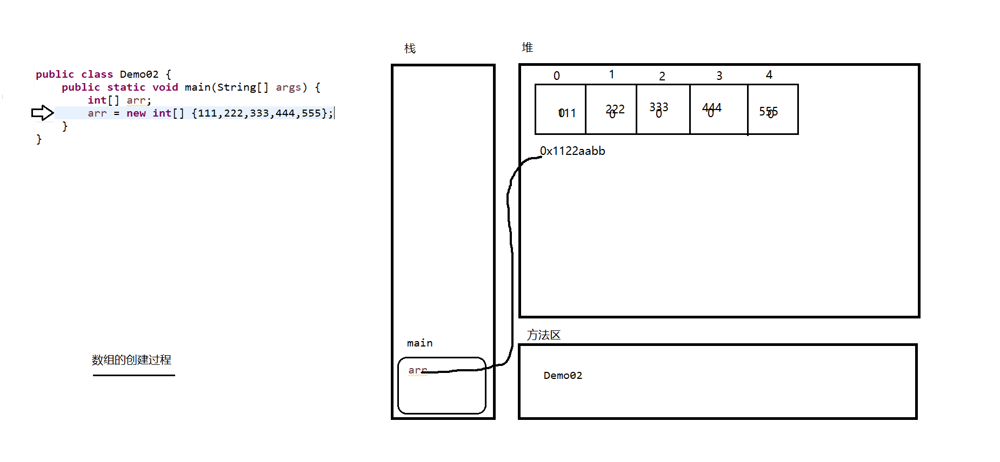

# Day 07笔记

## 一、输出质数

```java
package com.qf.demos;

public class Demo03 {
	public static void main(String[] args) {
		/**
		 * 	编写方法,输出2~~某个数之内的素数
		 * 	素数--质数
		 * 		只能被1和自身整除
		 * 
		 * 	10
		 * 	10/2
		 * 	10/3
		 *  10/4
		 *   
		 */
		printZhi(100);
	}
	
	public static void printZhi(int num) {
		for (int i = 2; i < num; i++) {
			// 假设一个数字是质数
			boolean flag = true;
			for (int j = 2; j < i; j++) {
				if (i % j == 0) {
					flag = false;
					break;
				}
			}
			
			// 判断flag是否被修改,如果没有被修改，没有整除的情况，是质数
			if (flag == true) {
				System.out.println(i);
			}
		}
	}
}
```

## 二、数组

### 2.1 概述

* 变量是在内存中开辟的一片空间，用来存储数据
* 数组是在内存中开辟一组连续的空间，用来存储相同类型的数据

### 2.2 创建数组

* 多态创建
* 静态创建

```java
package com.qf.arr;

public class Demo01 {
	public static void main(String[] args) {
		/**
		 * 	动态创建数组
		 * 		只是创建数组,没有向数组中添加数据
		 * 	
		 * 	静态创建数组
		 * 		创建数组的同时,确定数组中的数据
		 */
		// 声明一个数组变量
		int[] arr01;
		// 创建数组对象
		arr01 = new int[5];
		
		System.out.println("======================");
		
		// 声明数组并创建数组对象
		int[] arr02 = new int[6];
		
		System.out.println("======================");
		
		// 创建数组并确定数组中的数据
		int[] arr03 = new int[] {11,22,33,44,55};
		
		// 静态创建简写方式--有些场景不适用
		int[] arr04 = {111,222,333,444,555,666};
		
		System.out.println("======================");
		int arr05[] = {};
	}
}
```

### 2.3 数组创建过程



### 2.4 数组的访问

* 取值
* 赋值
* 数组中的元素在数组创建之后都会有一个下标
* 下标表示元素在数组中的索引，可以通过下标访问到元素
* 下标从0开始，最大是数组长度-1

```java
package com.qf.arr;

public class Demo03 {
	public static void main(String[] args) {
		String[] names = new String[6];
		// 修改数组中的元素
		names[0] = "诸葛亮";
		names[1] = "司马懿";
		names[2] = "庞统";
		names[3] = "周瑜";
		names[4] = "郭嘉";
		
		// 访问元素--获取元素--读取数据--读取元素
		/**
		 * names记录的数组的地址
		 * 	names[0]表示找到names指向数组中的第1个元素(下标为0的元素)
		 */
		String name0 = names[0];
		String name1 = names[1];
		String name2 = names[2];
		String name3 = names[3];
		String name4 = names[4];
		
		System.out.println(name0);
		System.out.println(name1);
		System.out.println(name2);
		System.out.println(name3);
		System.out.println(name4);
		
		names[0] = "孔明";
		System.out.println(names[0]);
		
	}
}
```

### 2.5 数组的索引

* 0开始
* 数组长度-1结束
* 如果不在上述范围内，会报错
  * Exception in thread "main" java.lang.ArrayIndexOutOfBoundsException: 6

### 2.6 遍历数组

* 通过数组中元素的下标遍历数组

* 可以使用

  * for
  * while
  * foreach

  ```java
  package com.qf.arr;
  
  public class Demo04 {
  	public static void main(String[] args) {
  		String[] names = new String[6];
  		names[0] = "曹操";
  		names[1] = "曹丕";
  		names[2] = "曹植";
  		names[3] = "曹彰";
  		names[4] = "曹冲";
  		names[5] = "曹仁";
  		
  		// 访问数组中的所有元素
  		System.out.println(names[0]);
  		System.out.println(names[1]);
  		System.out.println(names[2]);
  		System.out.println(names[3]);
  		System.out.println(names[4]);
  		System.out.println(names[5]);
  		
  		System.out.println("========for循环=========");
  		
  		for (int i = 0; i < names.length; i++) {
  			System.out.println(names[i]);
  		}
  		
  		System.out.println("========while循环=========");
  		int index = 0;
  		while (index < names.length) {
  			System.out.println(names[index]);
  			index++;
  		}
  		
  		System.out.println("========foreach循环=========");
  		/**
  		 * foreach
  		 * 	增强for
  		 * 	高级for
  		 * 	遍历数组、集合等可以迭代的数据
  		 * 	不用下标
  		 * 
  		 * for(元素类型  临时变量 : 目标数组){
  		 * 	
  		 * }
  		 */
  		for (String name : names) {
  			System.out.println(name);
  		}
  	}
  }
  ```

### 2.7 数组案例

* 倒序遍历

```
package com.qf.arr;

public class Demo05 {
	public static void main(String[] args) {
		String[] names = new String[6];
		
		names[0] = "武松";
		names[1] = "武植";
		names[2] = "西门大官人";
		names[3] = "潘金莲";
		names[4] = "王婆";
		names[5] = "郓哥";
		
		// 倒序遍历
		for (int i = names.length-1; i >= 0; i--) {
			System.out.println(names[i]);
		}
		
		System.out.println("========");
		
	}
}
```

* 编写方法，向数组中添加元素

```java
package com.qf.arr;

public class Demo06 {
	public static void main(String[] args) {
		
		/**
		 * 	创建一个字符数组--char[]
		 * 		编写一个方法，向数组中写入a--z
		 */
		
		char[] chars = new char[26];
		
		addChar(chars);
		
		for (char c : chars) {
			System.out.println(c);
		}
		
		System.out.println("=============");
		
		// 向数组中添加Z--A
		addUpChars(chars);
		
		for (char c : chars) {
			System.out.println(c);
		}
		
	}

	/**
	 * 	向数组添加Z--A
	 * @param chars
	 */
	public static void addUpChars(char[] chars) {
		for (int i = 0; i < chars.length; i++) {
			chars[i] = (char) (90-i);
		}
	}

	/**
	 * 	向字符数组中添加a--z
	 * @param chars
	 */
	public static void addChar(char[] chars) {
		for (int i = 0; i < chars.length; i++) {
			chars[i] = (char) (i+97);
		}
	}
}
```

### 2.8 数组中各种类型数据的默认值

| 类型     | 默认值           |
| -------- | ---------------- |
| byte     | 0                |
| short    | 0                |
| int      | 0                |
| long     | 0                |
| float    | 0.0              |
| double   | 0.0              |
| boolean  | false            |
| char     | \u0000  （空格） |
| 引用类型 | null             |

```java
package com.qf.arr;

import java.util.Scanner;

public class Demo07 {
	public static void main(String[] args) {
		/**
		 *  	数组中元素的默认值
		 * 	基本类型
		 * 		类型		默认值
		 * 		byte	0
		 * 		short	0
		 * 		int		0
		 * 		long	0
		 * 		float	0.0
		 * 		double	0.0	
		 * 		boolean	false
		 * 		char	\u0000
		 * 	引用类型
		 * 		String	null
		 * 		System	null
		 * 		Scanner	null
		 * 		... ...
		 */
		System.out.println("========byte=========");
		byte[] arrByte = new byte[10];
		System.out.println(arrByte[0]);
		System.out.println(arrByte[1]);
		System.out.println(arrByte[2]);
		
		System.out.println("========short=========");
		short[] arrShort = new short[10];
		System.out.println(arrShort[0]);
		System.out.println(arrShort[3]);
		System.out.println(arrShort[7]);
		
		System.out.println("========int=========");
		int[] arrInt = new int[10];
		System.out.println(arrInt[3]);
		System.out.println(arrInt[6]);
		System.out.println(arrInt[9]);
		
		System.out.println("========long=========");
		long[] arrLong = new long[10];
		System.out.println(arrLong[1]);
		System.out.println(arrLong[4]);
		System.out.println(arrLong[7]);
		
		System.out.println("========float=========");
		float[] arrFloat = new float[10];
		System.out.println(arrFloat[2]);
		System.out.println(arrFloat[5]);
		System.out.println(arrFloat[8]);
		
		// ctrl + alt + ↓
		
		System.out.println("========double=========");
		double[] arrDouble = new double[10];
		System.out.println(arrDouble[3]);
		System.out.println(arrDouble[5]);
		System.out.println(arrDouble[7]);
		
		System.out.println("========boolean=========");
		boolean[] arrBoolean = new boolean[10];
		System.out.println(arrBoolean[1]);
		System.out.println(arrBoolean[5]);
		System.out.println(arrBoolean[9]);
		
		System.out.println("========char=========");
		char[] arrChar = new char[10];
		System.out.println(arrChar[4]);
		System.out.println(arrChar[5]);
		System.out.println(arrChar[6]);
		
		System.out.println("========String=========");
		String[] arrString = new String[10];
		System.out.println(arrString[7]);
		System.out.println(arrString[8]);
		System.out.println(arrString[9]);
		
		System.out.println("========Scanner=========");
		Scanner[] arrScanner = new Scanner[10];
		System.out.println(arrScanner[1]);
		System.out.println(arrScanner[2]);
		System.out.println(arrScanner[3]);
		
		System.out.println("========Object=========");
		Object[] arrObject = new Object[10];
		System.out.println(arrObject[2]);
		System.out.println(arrObject[5]);
		System.out.println(arrObject[8]);
		
	}
}
```

### 2.9 计算数组元素总和、平均值

```java
package com.qf.arr;

public class Demo09 {

	public static void main(String[] args) {
		/**
		 * 	统计所有数字的总和
		 * 	统计平均值
		 * 
		 * 	找指定元素的第一次出现的位置
		 * 	找指定元素最后一次出现的位置
		 * 	找元素出现的次数
		 * 	找是佛包含指定元素
		 * 
		 * 	翻转数组
		 * 	合并数组
		 */
		
		int[] arr = new int[] {456,41,3246,76121,64,94,32,135,798};
		
		int sum = 0;
		for (int i = 0; i < arr.length; i++) {
			sum += arr[i];
		}
		System.out.println("arr数组元素的总和是:" + sum);
		System.out.println("arr数组元素的额平均值是:" + (1.0*sum/arr.length));
	}
	
	/**
	 * 	计算数组元素的总和
	 * @param arr
	 * @return
	 */
	public static int getSum(int[] arr) {
		int sum = 0;
		for (int i = 0; i < arr.length; i++) {
			sum += arr[i];
		}
		return sum;
	}

}
```

### 2.10 查询元素出现的位置

```java
package com.qf.arr;

import java.util.Scanner;

public class Demo10 {
	public static void main(String[] args) {
		/**
		 * 	查找最大值
		 * 	翻转数组
		 * 	合并数组
		 * 
		 * 	找元素出现的次数
		 * 	找指定元素最后一次出现的位置
		 * 	查找最小值
		 * 	找是否包含指定元素
		 */
		
		/**
		 * 	键盘录入一个数字，查找出现第一次的位置，如果没有返回-1
		 * 1、创建Scanner对象
		 * 2、提示输入数字
		 * 3、获取输入的数字
		 * 4、查找
		 * 5、输出结果
		 */
		int[] arr = new int[] {456,156,46,132,16,7,6132,1,687,91,7,6132,1,687,9132,13,98,4,132};
		Scanner sc = new Scanner(System.in);
		
		System.out.println("请输入要查找的数字：");
		int num = sc.nextInt();
		
		// 假设没有这个数字,位置是-1
		int index = -1;
		for (int i = 0; i < arr.length; i++) {
			if (num == arr[i]) {
				index = i;
				break;
			}
		}
		System.out.println(num + "的索引是:" + index);
	}
}
```

### 2.11 查找数组中的最大值

```java
package com.qf.arr;

public class Demo11 {
	public static void main(String[] args) {
		/**
		 * 	查找数组中的最大值
		 */
		int[] arr = new int[] {456,156,46,132,16,7,6132,1,687,91,7,6132,1,687,9132,13,98,4,132};
		
		// 假设第一个元素是最大的
		int max = arr[0];
		
		for (int i = 1; i < arr.length; i++) {
			// 挨个向后比较,如果发现更大的,记录之
			if (arr[i] > max) {
				max = arr[i];
			}
		}
		System.out.println("arr数组中的最大的元素是:" + max);
	}
}
```

### 2.12 翻转数组

```java
package com.qf.arr;

public class Demo12 {
	public static void main(String[] args) {
		/**
		 * 	翻转数组
		 * 		遍历数组的前面一半
		 * 		把前面一半的数据和后面的交换
		 */
		int[] arr = new int[] {456,156,46,13,4,132};
		for (int i : arr) {
			System.out.print(i + ",");
		}
		System.out.println();
		
		for (int i = 0; i < arr.length/2; i++) {
			// 交换
			int temp = arr[i];
			arr[i] = arr[arr.length-i-1];
			arr[arr.length-i-1] = temp;
		}
		
		for (int i : arr) {
			System.out.print(i + ",");
		}
		System.out.println();
	}
}
```

## 三、数组扩容

### 3.1 概述

* 生产中有时候需要把多个数组中的元素合并到同一个
* 数组一旦创建不能改变
  * 数据类型不能变
  * 数组长度不能变
* 创建一个新的数组存储这些元素

### 3.2 手动扩容

```java
package com.qf.arr;

public class Demo13 {
	public static void main(String[] args) {
		String[] name01 = {"司马懿","司马孚","司马进","司马朗","司马敏"};
		String[] name02 = {"孙策","孙权","孙坚","孙尚香"};
		
		// 合并两个数组
		String[] names = new String[name01.length + name02.length];
		
		// 取出name01数组中的元素放入names
		for (int i = 0; i < name01.length; i++) {
			names[i] = name01[i];
		}
		
		// 把name02中的元素放入names
		for (int i = 0; i < name02.length; i++) {
			names[name01.length + i] = name02[i];
		}
		
		System.out.println(names.length);
		for (String name : names) {
			System.out.println(name);
		}
	}
}
```

### 3.3 System.arraycopy

* 从指定源数组中复制一个数组，复制从指定的位置开始，到目标数组的指定位置结束。

* 从 src 引用的源数组到 dest 引用的目标数组，数组组件的一个子序列被复制下来。

* 被复制的组件的编号等于 length 参数。

* 源数组中位置在 srcPos 到 srcPos+length-1 之间的组件被分别复制到目标数组中的 destPos 到 destPos+length-1 位置。 

* ```
  src - 源数组。
  srcPos - 源数组中的起始位置。
  dest - 目标数组。
  destPos - 目标数据中的起始位置。
  length - 要复制的数组元素的数量。 
  ```

  

```
package com.qf.arr;

public class Demo14 {
	public static void main(String[] args) {
		String[] name01 = {"司马懿","司马孚","司马进","司马朗","司马敏"};
		String[] name02 = {"孙策","孙权","孙坚","孙尚香"};
		
		String[] names = new String[name01.length + name02.length];
		
		// 使用arraycopy方法复制name01
		System.arraycopy(name01, 0, names, 0, name01.length);
		for (String name : names) {
			System.out.println(name);
		}
		
		System.out.println("===========");
		
		// 使用arrayCopy方法复制name02
		System.arraycopy(name02, 0, names, name01.length, name02.length);
		for (String name : names) {
			System.out.println(name);
		}
		
	}
}
```

### 3.4 Arrays.copyOf

* 此类包含用来操作数组（比如排序和搜索）的各种方法。
* 复制指定的数组，截取或用 0 填充（如有必要），以使副本具有指定的长度。

```java
package com.qf.arr;

import java.util.Arrays;

public class Demo15 {
	public static void main(String[] args) {
		int[] arr = {11,22,33,44,55};
		/**
		 * newLength的三种情况
		 * 	大于arr.length
		 * 		返回新数组，包含arr中的所有数据，超出的部分使用默认值填充
		 * 	等于arr.length
		 * 		返回新数组，和arr数组数据完全相同
		 * 	小于arr.length
		 * 		返回新数组，截取中的部分数据
		 */
		int[] newArr = Arrays.copyOf(arr, 3);
		
		System.out.println(newArr.length);
		for (int i : newArr) {
			System.out.println(i);
		}
	}
}
```

## 四、常量

* 在程序运行过程中，其值不能发生改变
* 常量在内存的常量池中

* 字面值常量
  * a
  * abc
  * hello
  * 110
* 自定义常量
  * 你的生日
  * 你的出生地
  * ... ...
  * final String birthday = 1999*12*30

## 五、基本类型和引用类型（熟悉）

```
package com.qf.arr;

public class Demo16 {
	public static void main(String[] args) {
		int[] arr01 = new int[]{11,22,33,44,55};
		int[] arr02 = new int[]{11,22,33,44,55};
		
		int num01 = 66;
		int num02 = 66;
		
		System.out.println(num01 == num02);
		System.out.println(arr01 == arr02);
		
		int[] arr03 = arr01;
		
		for (int i : arr01) {
			System.out.println(i);
		}
		
		arr03[0] = 1111;
		
		for (int i : arr01) {
			System.out.println(i);
		}
		
	}
}
```

