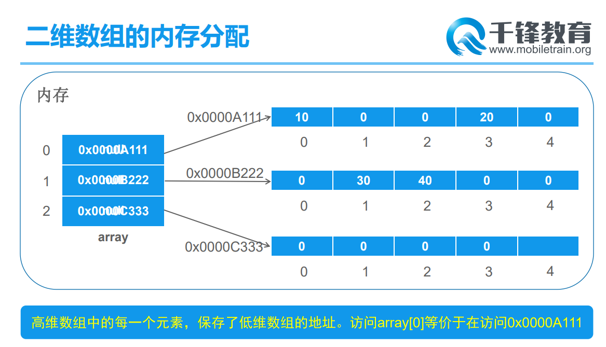

# Day 08笔记

## 一、引用类型当做参数传递

### 1.1 概述

* 方法的声明中可以定义形参的类型

  * 可以是基本类型

  * 可以是引用类型

    

### 1.2 基本类型的参数

* 传递的是字面值
* 传递的是常量
* 操作的是副本

```java
package com.qf.arr;

public class Demo02 {
	public static void main(String[] args) {
		int num = 33;
		System.out.println(num);
		
		changeNum(num);
		System.out.println(num);
	}
	
	public static void changeNum(int n) {
		n = 55;
	}
}
```

### 1.3 引用类型的参数

* 传递的是地址值
* 操作的是具体的对象

```java
package com.qf.arr;

public class Demo03 {
	public static void main(String[] args) {
		int[] arr = new int[] {11,22,33};
		System.out.println(arr[0]);
		
		changeArr(arr);
		System.out.println(arr[0]);
		
	}
	
	public static void changeArr(int[] a) {
		a[0] = 110;
	}
}
```

## 二、引用类型返回值

### 2.1 概述

* 方法运行结束可能会得到一个结果，结果的类型可以是
  * 基本类型
  * 引用类型

### 2.2 案例

```java
package com.qf.arr;

public class Demo04 {
	public static void main(String[] args) {
		String[] name01 = {"吕布","马超","典韦","许褚"};
		String[] name02 = {"林冲","武松","鲁智深","呼延灼"};
		
		String[] names = mergeArr(name01, name02);
		for (String name : names) {
			System.out.println(name);
		}
		
	}
	
	/**
	 * 	合并数组
	 * @param s1
	 * @param s2
	 * @return
	 */
	public static String[] mergeArr(String[] s1,String[] s2) {
		String[] names = new String[s1.length + s2.length];
		
		// 合并s1和s2
		System.arraycopy(s1, 0, names, 0, s1.length);
		System.arraycopy(s2, 0, names, s1.length, s2.length);
		
		// 返回合并之后的数组
		return names;
	}
}
```

## 三、方法重载

### 3.1 概述

* 有时候我们调用方法的时候会传入不同类型、个数的参数
* 方法的名字要保持一样
* 这种情况在编程语言中称为方法重载

### 3.2 重载show

```java
package com.qf.arr;

public class Demo06 {
	public static void main(String[] args) {
		/**
		 * 	自我介绍
		 * 		名字
		 * 		名字、年龄
		 * 		名字、年龄、地址
		 * 		名字、专业
		 * 		名字、备注
		 * 
		 * 	自我介绍的方法
		 * 	show
		 * 
		 *	虚拟机通过方法的声明部分区分方法
		 *		方法有两个部分
		 *			声明
		 *				参数列表鸡以及之前的所有你
		 *			实现
		 *				{}中的所有内容
		 *	
		 *	同一个类中出现了名字相同的方法，它们的参数列表不同
		 *		方法重载
		 */
		
		show("张三", 23);
		
		show("lisisi");
		
		
	}
	
	public static void show(String name) {
		System.out.println("我是:" + name);
	}
	
	public static void show(String name,int age) {
		System.out.println("我是:" + name + ",今年:" + age);
	}
	
}
```

### 3.3 重载的情况

* 参数的个数不同
* 参数的类型不同

```
package com.qf.arr;

public class Demo07 {
	public static void main(String[] args) {
		int sum = getSum(33, 55);
		double sum2 = getSum(33.33, 55.55);
	}
	
	public static int getSum(int a,int b) {
		return a + b;
	}
	
	public static double getSum(double a,double b) {
		return a + b;
	}
}
```

* 参数的顺序不同

```java
package com.qf.arr;

public class Demo08 {
	public static void main(String[] args) {
		show(23, "张三");
		show("张三", 23);
	}
	
	public static void show(String name,int age) {
		
	}
	
	public static void show(int age,String name) {
		
	}
}
```

### 3.4 不定长参数

```java
package com.qf.arr;

public class Demo09 {
	public static void main(String[] args) {
		getSum(11);
		int[] arr = new int[] {};
		System.out.println(arr);
		double[] d = new double[] {};
		System.out.println(d);
	}
	
	public static int getSum(int a) {
		System.out.println("===========");
		return a;
	}
	
	public static int getSum(int a,int b) {
		return a+b;
	}
	
	public static int getSum(int a,int b,int c) {
		return a+b+c;
	}
	
	public static int getSum(int a,int b,int c,int d) {
		return a+b+c+d;
	}
	
	public static int getSum(int a,int b,int c,int d,int e) {
		return a+b+c+d+e;
	}
	
	public static int getSum(int a,int b,int c,int d,int e,int f) {
		return a+b+c+d+e+f;
	}

	// 张三说:我们班里有20同学,他们的名字是:zhangsi,zhangwu,zhangliu...
	/**
	 * 	不定长参数--不确定长度,使用省略号
	 * @param is
	 * @return
	 */
	public static int getSum(int...is) {
		System.out.println(is);
		int sum = 0;
		for (int i = 0; i < is.length; i++) {
			sum += is[i];
		}
		return sum;
	}
}
```

### 3.5 不定长参数注意

* 能不能和其他参数混用
  * 可以的
* 能不能在同一个方法中定义多个不定长参数
  * 不能
  * 每一个不定长参数都必须放在形参的最后一位

```java
package com.qf.arr;

public class Demo10 {
	public static void main(String[] args) {
		
	}
	
	public static void show(String...strs) {
		for (String str : strs) {
			System.out.println(str);
		}
	}
	
	public static void show(int age,String...strs) {
		System.out.println("我今年" + age);
		for (String str : strs) {
			System.out.println(str);
		}
	}
	
	public static void show(double d,int age,String...strs) {
		System.out.println("我今年" + age);
		for (String str : strs) {
			System.out.println(str);
		}
	}	
}
```

### 3.6 方法重载注意事项

*  重载只和方法名&参数列表有关
* 和返回值类型无关
* 和修饰符无关

```java
package com.qf.arr;

public class Demo11 {
	public static void main(String[] args) {
		
	}
	
	public static void getSum() {
		
	}
	
	public static int getSum() {
		return 0;
	}
}
```

## 四、数组工具类

### 4.1 概述

* 此类包含用来操作数组（比如排序和搜索）的各种方法。

### 4.2 常用方法

```java
package com.qf.arr;

import java.util.Arrays;

public class Demo12 {
	public static void main(String[] args) {

		int[] arrInt = new int[] {11,22,33};
		for (int i : arrInt) {
			System.out.println(i);
		}
		
		System.out.println("==========");
		
		// 使用指定元素填充整个数组
		Arrays.fill(arrInt, 666);
		
		for (int i : arrInt) {
			System.out.println(i);
		}
		
		System.out.println("===========");
		
		int[] arr01 = {1,31,6546,123,165,489,51,321,654,651,0231,65,8512,3};
		for (int i : arr01) {
			System.out.print(i + ",");
		}
		System.out.println();
		
		// 按照元素的自然顺序排序
		Arrays.sort(arr01);
		for (int i : arr01) {
			System.out.print(i + ",");
		}
		System.out.println();
		
		// 把数组转换成字符串
		String str = Arrays.toString(arr01);
		System.out.println(str);
		System.out.println(str.getClass());
		System.out.println(Arrays.toString(arr01));
	}
}
```

### 4.3 猜数字游戏

```java
package com.qf.arr;

import java.util.Random;
import java.util.Scanner;

public class Demo13 {
	public static void main(String[] args) {
		/**
		 * 	随机出生成0--100之间的一个整数
		 * 	给7次机会猜，看运气
		 */
		Random r = new Random();
		int num = r.nextInt(100);
		
		Scanner sc = new Scanner(System.in);
		
		int count = 7;
		while (count > 0) {
			count--;
			System.out.println("请猜一个数字(0--100):");
			int i = sc.nextInt();
			// 判断你输入的数字和随机数字
			if (i == num) {
				System.out.println("猜对啦,还剩下机会次数:" + count);
				break;
			} else if (i > num) {
				System.out.println("数字猜大啦啦啦啦");
			} else {
				System.out.println("数字猜小啦啦啦啦");
			}
			System.out.println("还剩下机会:" + count);
		}
	}
}
```

## 五、排序

### 5.1 冒泡排序

* 大的向后，小的向前
* 比较的总轮数是
  * 数组长度-1
* 每一轮比较找出一个最大值
* 每一轮比较的次数逐渐减少

```java
package com.qf.sort;

import java.util.Arrays;

public class Demo01 {
	public static void main(String[] args) {
		/**
		 * 	冒泡排序
		 */
		
		int[] arr = new int[] {465,1654,12,38,45};
		
		for (int i = 0; i < arr.length-1; i++) {
			for (int j = 0; j < arr.length-1-i; j++) {
				if (arr[j] > arr[j+1]) {
					// 如果前面的大于后面的,交换它们
					int temp = arr[j];
					arr[j] = arr[j+1];
					arr[j+1] = temp;
				}
			}
		}
		System.out.println(Arrays.toString(arr));
	}
}
```

### 5.2 选择排序

* 从1个开始，每次比较找到最小的元素，把这个元素放在最前面，依次向后执行
  * 第一次从0位开始
  * 第二次从1位开始
  * ... ....

```java
package com.qf.sort;

import java.util.Arrays;

public class Demo02 {
	public static void main(String[] args) {
		/**
		 * 	选择排序
		 */
		int[] arr = new int[] {465,1654,12,38,45};
		
		for (int i = 0; i < arr.length-1; i++) {
			int minIndex = i;
			for (int j = i+1; j < arr.length; j++) {
				if (arr[j] < arr[minIndex]) {
					minIndex = j;
				}
			}
			
			// 判断minIndex的值是否发生改变
			if (minIndex != i) {
				int temp = arr[i];
				arr[i] = arr[minIndex];
				arr[minIndex] = temp;
			}
		}
		System.out.println(Arrays.toString(arr));
	}
}
```

## 六、二维数组

### 6.1 概述

* 数组
* 数组中存储的元素还是数组
* 数组的嵌套

### 6.2 二维数组的创建

```java
package com.qf.arr2d;

public class Demo01 {
	public static void main(String[] args) {
		/**
		 * 	二维数组--数组的嵌套--数组中存储的数据还是数组
		 */
		
		// 声明一个二维数组
		int[][] arr01;
		
		// 创建二维数组,二维数组中有两个一维数组int[一维数组的数量][一维数组中元素的个数]
		/**
		 * 	创建二维数组
		 * 		二维数组存2个一维数组
		 * 		每个一维数组存3个int元素
		 */
		arr01 = new int[2][3];
		System.out.println(arr01);
		
		// 声明的同时创建数组,分配空间
		int[][] arr02 = new int[3][5];
		
		int[][] arr03 = {{11,22,33},{44,55,66}};
		
		int[][] arr04 = new int[][] {{},{}};
		
	}
}
```

### 6.3 二维数组元素的访问

* 先访问二维数组中的一维数组
* 在访问一维数组中的元素

```java
package com.qf.arr2d;

public class Demo02 {
	public static void main(String[] args) {
		int[][] arr = new int[3][2];
		
		System.out.println(arr[0].length);
		System.out.println(arr[1].length);
		System.out.println(arr[2].length);
		
		System.out.println("-------------");
		
		int[][] arrr = new int[3][];
		// 给每一个一维数组创建对象
		System.out.println(arrr[0]);
		System.out.println(arrr[1]);
		System.out.println(arrr[2]);
		
		arrr[0] = new int[] {11,22,33};
		arrr[1] = new int[] {22,33,44,55};
		arrr[2] = new int[] {33,44,55,66,77};
		
		System.out.println(arrr[0].length);
		System.out.println(arrr[1].length);
		System.out.println(arrr[2].length);
		
		System.out.println(arrr[1][1]);
	}
}
```

### 6.4 二维数组的内存分配

* 二维数组存的是一维数组的地址值



### 6.5 二维数组遍历

```java
package com.qf.arr2d;

public class Demo03 {
	public static void main(String[] args) {
		/**
		 * 	存储四大名著中一些人物的名字
		 * 		每个名著是一个独立的数组
		 * 		把四大名著放在二维数组中
		 */
		
		String[][] names = new String[2][];
		
		names[0] = new String[] {"嫦娥","兔子精","孔雀公主","女儿国国王","白骨精","铁扇公主"};
		names[1] = new String[] {"贾宝玉","林黛玉","薛宝钗","王熙凤"};
		
		for (int i = 0; i < names.length; i++) {
			System.out.println(names[i]);
			
			for (int j = 0; j < names[i].length; j++) {
				System.out.println(names[i][j]);
			}
		}
	}
}
```

