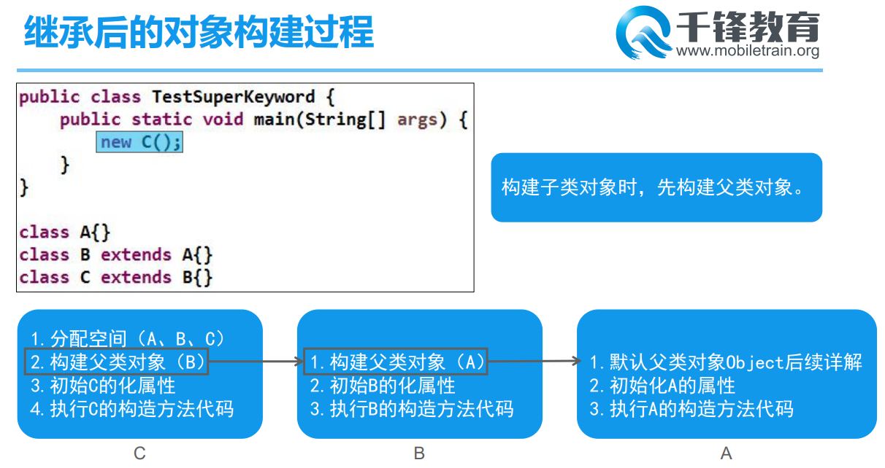

# Day11 笔记

## 一、super关键字

### 1.1 概述

* 子类中的属性名字可能和父类相同
  * 属性的覆盖
* 子类中的方法可能和父类中的方法名字一样
  * 方法重写
* 有时候需要指明调用父类中的属性和方法
* 使用super关键字解决

### 1.2 super的使用

* 调用父类属性
  * super.属性
* 调用父类方法
  * super.方法(参数)
* 调用构造器
  * super(参数)
  * 必须放在第一行
  * 调用构造器的时候this和super不能同时使用

```java
package com.qf.super0;

public class Demo01 {
	public static void main(String[] args) {
		Human h1 = new Human();
		System.out.println(h1.type);
		System.out.println(h1.age);
		
		h1.eat();
		h1.show();
		h1.eat();
		
		System.out.println("================");
		
		Human h2 = new Human("动物类", 22,"张三");
		
	}
}

class Animal{
	String type = "动物";
	int age;
	
	public Animal() {
		super();
	}

	public Animal(String type, int age) {
		super();
		this.type = type;
		this.age = age;
		System.out.println("父类的构造器");
	}
	
	public void eat() {
		System.out.println("动物需要进食");
	}
	
	public void sleep() {
		
	}
}

class Human extends Animal{
	String name;
	// 子类的属性屏蔽了继承的父类属性
	String type = "人类";
	
	public Human() {
		
	}
	
	public Human(String name, String type) {
		super();
		this.name = name;
		this.type = type;
	}

	public Human(String type, int age,String name) {
		super(type, age);
		System.out.println("子类的构造器");
		this.name = name;
	}

	public void show() {
		// 这个type需要使用Animal中的type
		System.out.println("人在自然界中是" + super.type);
	}
	
	@Override
	public void eat() {
		// 调用父类中的方法
		super.eat();
		System.out.println("子类重写eat方法");
	}
}
```

### 1.3 this PK super

* this表示当前对象的引用
  * 可以调用当前类中的属性和方法
* super指向父类
  * 可以调用父类的属性和方法
* 调用构造器的时候都必须放在构造器的第一行

## 二、子类对象的创建

### 2.1 概述

* 子类对象的创建过程中需要先创建父类的对象



### 2.2 案例

```java
package com.qf.super0;

public class Demo02 {
	public static void main(String[] args) {
		C c = new C();
		System.out.println(c.strA);
		System.out.println(c.strB);
		System.out.println(c.strC);
		
		c.showA();
		c.showB();
		c.showC();
	}
}

class A{
	String strA = "AAA";
	
	public A() {
		super();
		System.out.println("类A中的构造器....");
	}

	public void showA() {
		System.out.println("A类中的showA");
	}
}

class B extends A{
	String strB = "BBB";
	
	public B() {
		super();
		System.out.println("类B中的构造器....");
	}

	public void showB() {
		System.out.println("B类中的showB");
	}
	
}

class C extends B{
	String strC = "CCC";
	
	public C() {
		super();
		System.out.println("类C中的构造器....");
	}

	public void showC() {
		System.out.println("C类中的showC");
	}
	
}
```

### 2.3 父类没有空参构造器的时候

* 子类对象创建的过程中无论如何都要调用父类的构造器
  * 可以是有参数的
  * 也可是无参数的

```java
package com.qf.super0;

public class Demo03 {
	public static void main(String[] args) {
		// BB bb = new BB();
		
	}
}

class AA{
	String strAA = "AA";

	public AA(String strAA) {
		super();
		System.out.println("AA类中的构造器");
	}
	
}

class BB extends AA{
	public BB(String strAA) {
		super(strAA);
	}

	String strBB = "BB";
}
```

## 三、多态

###  3.1 概述

* 生活中的多态
  * 客观实在在大脑中的主观想法
  * 人的不同身份
    * 可以是儿子
    * 可以是孙子
    * 可以是同学
    * 可以是爸爸
* 程序中的多态
  * 父类引用指向子类对象
  * 声明的是动物，引用指向的是动物的子类对象

### 3.2 多态创建

```java
package com.qf.poly;

public class Demo01 {
	public static void main(String[] args) {
		/**
		 * 动物 小动物 = 火蝾螈实体;
		 * 	小动物.eat()====>  小鱼小虾
		 * 	小动物.sleep() ==> 飘着睡
		 */
		/**
		 * 父类引用指向子类对象--多态
		 * 	把蝾螈当做动物看待
		 */
		Animal animal;
		animal = new Salamander();
		animal.eat();
		
		/**
		 *  把蝾螈当做捕猎者看待
		 */
		Hunter hunter = new Salamander();
		hunter.hunt();
	}
}

class Animal extends Hunter{
	String type = "动物";
	String name;
	int age;
	
	public void eat() {
		System.out.println("动物需要进食");
	}
	
	public void sleep() {
		System.out.println("动物需要休息");
	}
}

class Salamander extends Animal{
	@Override
	public void eat() {
		System.out.println("火蝾螈喜欢吃小鱼小虾");
	}
	
	@Override
	public void sleep() {
		System.out.println("火蝾螈睡觉的姿势的飘着睡");
	}
	
	@Override
	public void hunt() {
		System.out.println("蝾螈可以捕食一些小的动物");
	}
}

class Hunter{
	String type;
	
	public void hunt() {
		System.out.println("猎手可以捕获猎物");
	}
	
}
```

### 3.3 多态中属性和方法的调用

* 方法的调用
  * 优先使用子类中重写之后的方法
  * 如果子类没有重写，调用父类中的方法
* 属性的调用
  * 只调用父类中的属性
  * 子类覆盖--没有作用
* 子类独有的方法
  * 多态的引用不能调用到
* 子类独有的属性
  * 无法调用

```java
package com.qf.poly;

public class Demo03 {
	public static void main(String[] args) {
		/**
		 * 正常创建对象
		 * 	调用自己的属性和方法
		 */
		Worker w1 = new Worker();
		w1.work();
		System.out.println("type属性:" + w1.type);	// 工人
		System.out.println("=======================");
		
		/**
		 * 多态的创建对象方式
		 * 	可以调用父类的方法
		 */
		Worker w2 = new ZongziWorker();
		w2.work();
		System.out.println("type属性:" + w2.type);	// 粽子工
		System.out.println("=======================");
		
		/**
		 * 多态的创建对象方式
		 * 	可以调用父类的方法
		 * 	--如果子类重写了继承的方法，运行的是子类重写之后的方法
		 * 不能调用子类独有的方法
		 */
		Worker w3 = new MooncakeWorker();
		w3.work();
		System.out.println("type属性:" + w3.type);	// 月饼工
		
		// w3.eatMooncake();
	}
}

class Worker{
	String type = "工人";
	
	public void work() {
		System.out.println("工人做工");
	}
}

class ZongziWorker extends Worker{
	String type = "粽子工";
	
}

class MooncakeWorker extends Worker{
	String type = "月饼工";
	double salary = 6000;
	
	@Override
	public void work() {
		super.work();
		System.out.println("月饼工生产月饼");
	}
	
	public void eatMooncake() {
		System.out.println("月饼工人可以品尝月饼...");
	}
}
```

### 3.4 多态使用场景--当做方法的形参

```java
package com.qf.poly;

public class Demo04 {
	public static void main(String[] args) {
		
		sing(new Female());
	}
	
	/**
	 * 多态使用创建
	 * 	父类当做方法的形参
	 * @param human
	 */
	public static void sing(Human human) {
		human.sing();
	}
}


class Human{
	public void sing() {
		System.out.println("唱歌这些活动最早是为了祭天酬神");
	}
}

class Male extends Human{
	@Override
	public void sing() {
		System.out.println("男人唱歌比较豪放");
	}
}

class Female extends Human{
	@Override
	public void sing() {
		System.out.println("女人唱歌比较婉约");
	}
}
```

### 3.5 多态使用场景--当做方法的返回值

#### Auto类

```java
package com.qf.poly0;

/**
 * 所有汽车的父类
 *	提供方法
 *		start
 *		run
 *		func
 */
public class Auto {
	public void func() {
		System.out.println("车子能提供我们的效率");
	}
	
	public void start() {
		System.out.println("车子必须能启动");
	}
	
	public void stop() {
		System.out.println("车子必须能停车");
	}
}
```

#### Car类

```java
package com.qf.poly0;

/**
 * 小汽车类
 */
public class Car extends Auto {
	@Override
	public void start() {
		super.start();
		System.out.println("小汽车使用电启动");
	}
	
	@Override
	public void stop() {
		super.stop();
		System.out.println("小汽车使用刹车泵");
	}
	
	@Override
	public void func() {
		super.func();
		System.out.println("小汽车主要是家用,买菜、上下班...");
	}
}
```

#### Bus类

```java
package com.qf.poly0;

/**
 * 巴士车
 */
public class Bus extends Auto {
	@Override
	public void start() {
		super.start();
		System.out.println("巴士车紧急情况下可以使用人推启动");
	}
	
	@Override
	public void stop() {
		super.stop();
		System.out.println("公交车的刹车功能非常重要,使用鼓刹");
	}
	
	@Override
	public void func() {
		super.func();
		System.out.println("公交车用于城市通勤");
	}
}
```

#### AutoFactory

```java
package com.qf.poly0;

/**
 * 汽车工厂
 * 	负责生产汽车
 */
public class AutoFactory {
	public Auto getAuto(int num) {
		/**
		 * 1、小轿车
		 * 2、巴士车
		 * 3、拖拉机
		 * 4、摩托车
		 * 其他数字返回null
		 */
		Auto auto = null;
		// 根据num返回对应类型的车子
		switch (num) {
		case 1:
			System.out.println("小汽车生产成功");
			auto = new Car();
			break;
		
		case 2:
			System.out.println("巴士车生产成功");
			auto = new Bus();
			break;
			
		case 3:
			System.out.println("拖拉机生产成功");
			auto = new Tractor();
			break;
			
		case 4:
			System.out.println("摩托车生产成功");
			auto = new MOTOBicycle();
			break;

		default:
			System.err.println("车子不存在");
			break;
		}
		
		return auto;
	}
}
```

#### 测试类

```java
package com.qf.poly0;

import java.util.Scanner;

public class Demo01 {
	public static void main(String[] args) {
		/**
		 * 买车
		 * 	小客车
		 * 	巴士车
		 * 	摩托车
		 * 	拖拉机
		 * 	... ...
		 * 
		 * 汽车工厂生产汽车
		 * 	各种各样的汽车
		 * 	根据客户的需求生产汽车
		 * 
		 * 创建所有车子的父类--车子类
		 * 	车子类的子类
		 * 		小客车
		 * 		巴士车
		 * 		摩托车
		 * 		拖拉机
		 */
		
		Scanner sc = new Scanner(System.in);
		
		System.out.println("您需要什么类型的汽车("
				+ "		 * 1、小轿车\r\n" + 
				"		 * 2、巴士车\r\n" + 
				"		 * 3、拖拉机\r\n" + 
				"		 * 4、摩托车\r\n" + 
				"		 * 其他数字返回null):");
		int num = sc.nextInt();
		
		AutoFactory autoFactory = new AutoFactory();
		Auto auto = autoFactory.getAuto(num);
		
		auto.start();
		
	}
}
```

## 四、类型转换

### 4.1 概述

* 类型兼容的对象是可以互相转换的
* 大的===》小的
* 小的===》大的

### 4.2 向上转型

* 基本类型
  * 占用空间小的===》占用空间大的
* 引用类型
  * 子类提升为父类

### 4.3 向下转型

* 基本类型
  * 空间大的===》空间小的
* 引用类型
  * 父类转换成子类

```java
package com.qf.poly;

public class Demo05 {
	public static void main(String[] args) {
		// 向上转型--类型小的===》类型大的--天生安全
		byte b01 = 110;
		int i01 = b01;
		
		// 向下转型--类型大的===》类型小的==需要强制转换===》有风险
		int i02 = 1100;
		byte b02 = (byte) i02;
		System.out.println(b02);
	}
}
```

```java
package com.qf.poly;

public class Demo06 {
	public static void main(String[] args) {
		/**
		 * 向上转型
		 * 	类型小的===》类型大的
		 * 	安全
		 * 	只能调用父类的方法
		 * 	多态的核心概念
		 */
		Person p = new Man();
		p.dance();
		
		/**
		 * 向下转型
		 * 	转回小的类型
		 * 	有风险
		 * 	如果转回的是本身的类型--可以调用自己的属性和方法
		 * 
		 * 	如果转换成此父类的其他子类类型会报错：ClassCastException:
		 * 
		 * 	向下转换之前可以使用instanceof关键字检查
		 * 		如果结果为true则可以转
		 * 		否则不可以转
		 */
		
		Man man = (Man) p;
		man.fight();
		
		// Woman woman = (Woman)p;
		
		System.out.println(p instanceof Woman);
		System.out.println(p instanceof Man);
		
	}
}


class Person{
	String name = "人";
	int age = 22;
	
	public void dance() {
		System.out.println("人开心的时候会手舞足蹈...");
	}
	
}

class Man extends Person{
	@Override
	public void dance() {
		super.dance();
		System.out.println("男人喜欢跳迪斯科");
	}
	
	public void fight() {
		System.out.println("男性比较好斗");
	}
}

class Woman extends Person{
	@Override
	public void dance() {
		super.dance();
		System.out.println("女人喜欢跳广场舞");
	}
}
```

## 五、abstract

### 5.1 概述

* 抽象是不具体的，事实而非的，没有具体实现的
* 有些类不适合创建对象
* 有些方法不适合实现方法体
* 需要限制这些操作

### 5.2 不适合创建对象的类---抽象类

* 使用abstract修饰的类变成抽象类
* 无法直接创建对象
* 可以作为其他类的父类
  * 总结共性的属性和方法
  * 可以在多态中使用

```java
package com.qf.abstract0;

public class Demo01 {
	public static void main(String[] args) {
//		Animal a = new Animal();
//		a.eat();
//		a.sleep();
		
		Animal aa = new Dog();
		Dog dog = new Dog();
		dog.eat();
		dog.sleep();
	}
}

/**
 * 动物类
 * 	概况动物的属性和方法
 * 使用abstract修饰
 * 	变成抽象类
 * 	无法直接创建对象
 * 	可以被继承
 */
abstract class Animal{
	String type;
	String name;
	int age;
	
	public void eat() {
		System.out.println("动物需要吃饭");
	}
	
	public void sleep() {
		System.out.println("动物需要睡觉");
	}
}

class Dog extends Animal{
	
}
```

###  5.3 抽象方法

* 有些方法不应该被实现
  * 动物吃的方法
  * 工人工作的方法
* 可以使用abstract修饰方法，去除方法体
* 抽象方法必须放在抽象类中，抽象类中不一定有抽象方法
* 抽象类被继承后
  * 子类也是抽象类
  * 重写所有的抽象方法

```java
package com.qf.abstract0;

public class Demo02 {
	public static void main(String[] args) {
		JavaITWorker worker = new JavaITWorker();
		worker.work();
	}
}

abstract class Worker{
	public abstract void work();
	
	public abstract void eat();
	
	public abstract int makeMoney();
}

abstract class ITWorker extends Worker{
	
}


class JavaITWorker extends ITWorker{
	@Override
	public void work() {
		System.out.println("我们每天Coding");
	}

	@Override
	public void eat() {
		
	}

	@Override
	public int makeMoney() {
		return 0;
	}
}
```

### 5.4 抽象类中的内容

* 普通类中的内容
  * 实例变量
  * 实例方法
  * 构造器
* 抽象类中的内容
  * 抽象方法
  * 实例变量
  * 实例方法
  * 构造器
* 不能有私有的抽象方法

```java
package com.qf.abstract0;

public class Demo03 {
	public static void main(String[] args) {
		
	}
}

class People{
	String name;
	int age;
	
	public People() {
		super();
	}

	public People(String name, int age) {
		super();
		this.name = name;
		this.age = age;
	}
	
	public void show() {
		
	}
	
	private void showS() {
		
	}
}

abstract class Person{
	String name;
	private int age;
	
	public Person() {
		super();
	}

	public Person(String name, int age) {
		super();
		this.name = name;
		this.age = age;
	}
	
	public void show() {
		
	}
	
	// 抽象类中的抽象方法不能私有
	// private abstract void showS();
	
	public abstract void eat();
}
```

### 5.5 改进简单工厂

```java
package com.qf.poly0;

/**
 * 所有汽车的父类--不应被直接创建对象
 *	提供方法
 *		start
 *		run
 *		func
 */
public abstract class Auto {
	/*
		public void func() {
			System.out.println("车子能提供我们的效率");
		}
		
		public void start() {
			System.out.println("车子必须能启动");
		}
		
		public void stop() {
			System.out.println("车子必须能停车");
		}
	*/
	
	public abstract void func();
	
	public abstract void start();
	
	public abstract void stop();
}
```

