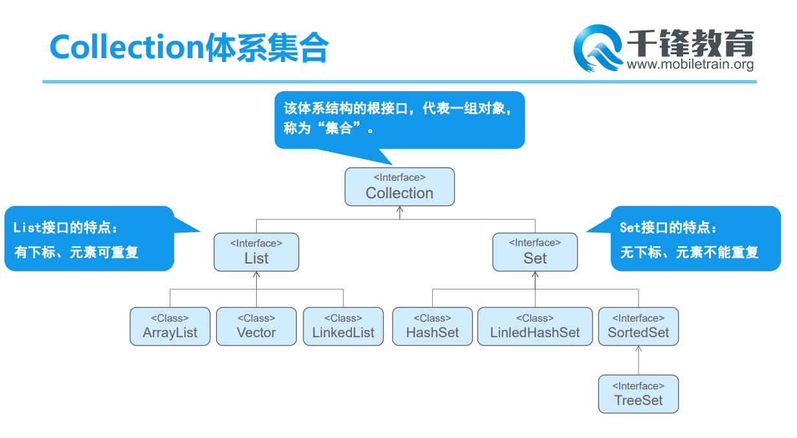

# Day15笔记

## 一、StringBuilder

### 1.1 概述

* 一个可变的字符序列。
* 此类提供一个与 `StringBuffer` 兼容的 API，但不保证同步。该类被设计用作 
  `StringBuffer` 的一个简易替换，用在字符串缓冲区被单个线程使用的时候（这种情况很普遍）。
* 如果可能，建议优先采用该类，因为在大多数实现中，它比 `StringBuffer` 要快。 
* 将 `StringBuilder` 的实例用于多个线程是不安全的。如果需要这样的同步，则建议使用 [`StringBuffer`](../../java/lang/StringBuffer.html)。 

### 1.2 创建对象

```
StringBuilder() 
          构造一个不带任何字符的字符串生成器，其初始容量为 16 个字符。 
StringBuilder(int capacity) 
          构造一个不带任何字符的字符串生成器，其初始容量由 capacity 参数指定。 
StringBuilder(String str) 
          构造一个字符串生成器，并初始化为指定的字符串内容。 
```

### 1.3 常用方法

* 使用方式详情见StringBuffer

### 1.4 StringBuffer 和 StringBuilder速度比较

```
package com.qf.sb;

public class Demo02 {
	public static void main(String[] args) {
		StringBuilder builder = new StringBuilder();
		//builder.append("床前明月光");
		
		StringBuffer buffer = new StringBuffer();
		//buffer.append("abcdefgabcdefg");
		
		addData(buffer);
		addData(builder);
		
	}
	
	/**
	 * 	统计StringBuffer插入10万条数据消耗的时间
	 *	 @param buffer
	 */
	public static void addData(StringBuffer buffer) {
		long startTime = System.currentTimeMillis();
		//builder.ensureCapacity(10000008);
		 for (int i = 0; i < 100000000; i++) {
			buffer.append(i);
		 }
		 long endTime = System.currentTimeMillis();
		 System.out.println(endTime - startTime);
		
	}
	
	/**
	 * 	统计StringBuilder插入10万条数据消耗的时间
	 *	 @param buffer
	 */
	public static void addData(StringBuilder builder) {
		long startTime = System.currentTimeMillis();
		builder.ensureCapacity(100000008);
		for (int i = 0; i < 100000000; i++) {
			builder.append(i);
		}
		long endTime = System.currentTimeMillis();
		System.out.println(endTime - startTime);
	}
}
```

### 1.5 两种字符串缓冲区比较

* 出现的版本
  * StringBuffer===jdk1.0
  * StringBuilder===1.5
* 线程
  * StringBuffer===安全
  * StringBuilder===不安全
* 效率
  * StringBuffer===相对慢
  * StringBuilder===相对快

## 二、System

### 2.1 概述

* `System` 类包含一些有用的类字段和方法。它不能被实例化。  
* 在 `System`  类提供的设施中，有标准输入、标准输出和错误输出流；
* 对外部定义的属性和环境变量的访问；加载文件和库的方法；还有快速复制数组的一部分的实用方法。 

### 2.2 字段

```
static PrintStream err 
          “标准”错误输出流。 
static InputStream in 
          “标准”输入流。 
static PrintStream out 
          “标准”输出流。 
```

### 2.3 常用方法

```java
package com.qf.sys;

import java.util.Map;
import java.util.Properties;

public class Demo01 {
	public static void main(String[] args) {
		/**
		 *  static long currentTimeMillis() 
			          返回以毫秒为单位的当前时间。 
			static Map<String,String> getenv() 
			          返回一个不能修改的当前系统环境的字符串映射视图。 
			static String getenv(String name) 
			          获取指定的环境变量值。 
			static Properties getProperties() 
			          确定当前的系统属性。 
			static String getProperty(String key) 
			          获取指定键指示的系统属性。 
			static void exit(int status) 
			          终止当前正在运行的 Java 虚拟机。 
			static void gc() 
			          运行垃圾回收器。 
		 */
		// 从1970年1月1日到当前的毫秒值
		System.out.println(System.currentTimeMillis());
		// 获取系统环境信息
		Map<String, String> map = System.getenv();
		System.out.println(map);
		
		// 获取java相关属性
		Properties properties = System.getProperties();
		System.out.println(properties);
		
		String property = System.getProperty("os.name");
		System.out.println(property);
	}
}
```

```java
package com.qf.sys;

public class Demo02 {
	public static void main(String[] args) {
		// gc
		for (int i = 0; i < 10; i++) {
			new Stu("张三" + i);
			// 手动调用垃圾回收器
			System.gc();
		}
		System.out.println("OVER");
	}
}

class Stu {
	String name;

	public Stu(String name) {
		super();
		this.name = name;
	}

	@Override
	public String toString() {
		return "Stu [name=" + name + "]";
	}

	@Override
	protected void finalize() throws Throwable {
		System.out.println(name + "被回收啦啦啦啦");
	}
}
```

### 2.4 终止虚拟机

```java
package com.qf.sys;

public class Demo03 {
	public static void main(String[] args) {
		/**
		 * break
		 * 	终止switch或者循环
		 * return
		 * 	结束方法，返回结果
		 * exit
		 * 	终止虚拟机
		 */
		
		System.out.println("main方法开始...");
		
		show();
		
		System.out.println("main方法结束...");
		
	}
	
	public static void show() {
		System.out.println("show方法开始...");
		
		for (int i = 0; i < 10; i++) {
			System.out.println(i);
			if (i == 6) {
				// break;
				// return;
				System.exit(0);
			}
		}
		
		System.out.println("show方法结束...");
	}
	
}
```

## 三、Math

### 3.1 概述

* `Math` 类包含用于执行基本数学运算的方法，如初等指数、对数、平方根和三角函数。 

### 3.2 字段

```
static double E 
          比任何其他值都更接近 e（即自然对数的底数）的 double 值。 
static double PI 
          比任何其他值都更接近 pi（即圆的周长与直径之比）的 double 值。 
```

### 3.3 常用方法

```java
package com.qf.comm;

public class Demo01 {
	public static void main(String[] args) {
		/**
		 * Math 类包含用于执行基本数学运算的方法，如初等指数、对数、平方根和三角函数。 
		    static double abs(double a) 
			          返回 double 值的绝对值。 
			static double cbrt(double a) 
			          返回 double 值的立方根。 
			static double ceil(double a) 
			          返回最小的（最接近负无穷大）double 值，该值大于等于参数，并等于某个整数。 
			static double floor(double a) 
			          返回最大的（最接近正无穷大）double 值，该值小于等于参数，并等于某个整数。 
			static double max(double a, double b) 
			          返回两个 double 值中较大的一个。 
			static double min(double a, double b) 
			          返回两个 double 值中较小的一个。 
			static double pow(double a, double b) 
			          返回第一个参数的第二个参数次幂的值。 
			static double random() 
			          返回带正号的 double 值，该值大于等于 0.0 且小于 1.0。 
			static long round(double a) 
			          返回最接近参数的 long。 
			static int round(float a) 
			          返回最接近参数的 int。 
			static double sqrt(double a) 
			          返回正确舍入的 double 值的正平方根。 
		 */
		
		System.out.println(Math.abs(3.3));
		System.out.println(Math.abs(-3.3));
		
		for (int i = 2; i <= 20; i++) {
			System.out.println(i + "的立方根是:" + Math.cbrt(i));
		}
		
		System.out.println(Math.ceil(3.3));
		System.out.println(Math.floor(3.3));
		
		System.out.println(Math.pow(2, 3));
		
		System.out.println(0.01*Math.pow(2, 30));
		
		for (int i = 0; i < 10; i++) {
			// 生成33--88之间的随机数
			System.out.println(Math.random());
		}
		
		System.out.println(Math.round(33.33));
		System.out.println(Math.round(33.55));
		
		for (int i = 2; i <= 20; i++) {
			System.out.println(i + "的平方根是:" + Math.sqrt(i));
		}
	}
}
```

## 四、Random

### 4.1 概述

* 此类的实例用于生成伪随机数流。

### 4.2 创建对象和使用

```java
package com.qf.comm;

import java.util.Random;

public class Demo02 {
	public static void main(String[] args) {
		/**
		 * 	此类的实例用于生成伪随机数流。
		 * 
		 * 	Random() 
			          创建一个新的随机数生成器。 
			Random(long seed) 
			          使用单个 long 种子创建一个新的随机数生成器。 
		 */
		
		Random r = new Random();
		for (int i = 0; i < 20; i++) {
			// 33-88之间的随机数
			System.out.println(r.nextInt(100));
		}
		
	}
}
```

## 五、BigDecimal

### 5.1 概述

* 能进行准确小数位数的运算

### 5.2 创建对象和使用

```java
package com.qf.comm;

import java.math.BigDecimal;

public class Demo03 {
	public static void main(String[] args) {
		System.out.println(1.0 - 0.9);
		System.out.println(10.0 / 3);
		
		BigDecimal bd01 = new BigDecimal("1.00");
		BigDecimal bd02 = new BigDecimal("0.90");
		
		System.out.println(bd01.add(bd02));
		System.out.println(bd01.subtract(bd02));
		System.out.println(bd01.multiply(bd02));
		// System.out.println(bd01.divide(bd02));
		System.out.println(bd01.divide(bd02, 4, BigDecimal.ROUND_HALF_UP));
		
		BigDecimal bd03 = new BigDecimal("10.0");
		BigDecimal bd04 = new BigDecimal("6.0");
		
		System.out.println(bd03.divide(bd04,5,BigDecimal.ROUND_HALF_UP));
	}
}
```

## 六、Date

### 6.1 概述

* 类 `Date` 表示特定的瞬间，精确到毫秒。 

### 6.2 创建对象

```java
Date() 
          分配 Date 对象并初始化此对象，以表示分配它的时间（精确到毫秒）。 
Date(int year, int month, int date) 
          已过时。 从 JDK 1.1 开始，由 Calendar.set(year + 1900, month, date) 或 GregorianCalendar(year + 1900, month, date) 取代。 
Date(int year, int month, int date, int hrs, int min) 
          已过时。 从 JDK 1.1 开始，由 Calendar.set(year + 1900, month, date, hrs, min) 或 GregorianCalendar(year + 1900, month, date, hrs, min) 取代。 
Date(int year, int month, int date, int hrs, int min, int sec) 
          已过时。 从 JDK 1.1 开始，由 Calendar.set(year + 1900, month, date, hrs, min, sec) 或 GregorianCalendar(year + 1900, month, date, hrs, min, sec) 取代。 
Date(long date) 
          分配 Date 对象并初始化此对象，以表示自从标准基准时间（称为“历元（epoch）”，即 1970 年 1 月 1 日 00:00:00 GMT）以来的指定毫秒数。 
Date(String s) 
          已过时。 从 JDK 1.1 开始，由 DateFormat.parse(String s) 取代。 
```

```java
package com.qf.comm;

import java.util.Date;

public class Demo04 {
	public static void main(String[] args) {
		/**
		 *  Date() 
			          分配 Date 对象并初始化此对象，以表示分配它的时间（精确到毫秒）。 
			Date(int year, int month, int date) 
			          已过时。 从 JDK 1.1 开始，由 Calendar.set(year + 1900, month, date) 或 GregorianCalendar(year + 1900, month, date) 取代。 
			Date(int year, int month, int date, int hrs, int min) 
			          已过时。 从 JDK 1.1 开始，由 Calendar.set(year + 1900, month, date, hrs, min) 或 GregorianCalendar(year + 1900, month, date, hrs, min) 取代。 
			Date(int year, int month, int date, int hrs, int min, int sec) 
			          已过时。 从 JDK 1.1 开始，由 Calendar.set(year + 1900, month, date, hrs, min, sec) 或 GregorianCalendar(year + 1900, month, date, hrs, min, sec) 取代。 
			Date(long date) 
			          分配 Date 对象并初始化此对象，以表示自从标准基准时间（称为“历元（epoch）”，即 1970 年 1 月 1 日 00:00:00 GMT）以来的指定毫秒数。 
			Date(String s) 
			          已过时。 从 JDK 1.1 开始，由 DateFormat.parse(String s) 取代。 
		 */
		Date date = new Date();
		System.out.println(date);
		
		Date date2 = new Date(121, 5, 11);
		System.out.println(date2);
		
		Date date3 = new Date(System.currentTimeMillis());
		System.out.println(date3);
	}
}
```

### 6.3 常用方法

* 大量方法已过时

```java
package com.qf.comm;

import java.util.Date;

public class Demo05 {
	public static void main(String[] args) {
		/**
		 * long getTime() 
		 * 	返回自 1970 年 1 月 1 日 00:00:00 GMT 以来此 Date 对象表示的毫秒数。 
		 * void setTime(long time) 
		 * 	设置此 Date 对象，以表示 1970 年 1 月 1 日 00:00:00 GMT 以后 time 毫秒的时间点。 
		 */
		
		Date date = new Date();
		System.out.println(date.getYear());
		System.out.println(date.getTime());
		System.out.println(System.currentTimeMillis());
	}
}
```

## 七、Calendar

### 7.1 概述

* `Calendar` 类是一个抽象类
* 它为特定瞬间与一组诸如 `YEAR`、`MONTH`、`DAY_OF_MONTH`、`HOUR` 等 [`日历字段`](../../java/util/Calendar.html#fields)之间的转换提供了一些方法，并为操作日历字段（例如获得下星期的日期）提供了一些方法。
* 瞬间可用毫秒值来表示，它是距*历元*（即格林威治标准时间 1970 年 1 月 1 日的 00:00:00.000，格里高利历）的偏移量。 

### 7.2 创建对象

* 是一个抽象类无法直接使用new的方式创建对象

```
package com.qf.comm;

import java.util.Calendar;

public class Demo06 {
	public static void main(String[] args) {
		Calendar rightNow = Calendar.getInstance();
		System.out.println(rightNow);
	}
}
```

### 7.3 常用方法

```java
package com.qf.comm;

import java.util.Calendar;

public class Demo07 {
	public static void main(String[] args) {
		/**
		 *   Date getTime() 
			          返回一个表示此 Calendar 时间值（从历元至现在的毫秒偏移量）的 Date 对象。 
			 long getTimeInMillis() 
			          返回此 Calendar 的时间值，以毫秒为单位。 
			 int get(int field) 
          		返回给定日历字段的值。 
          	 void set(int field, int value) 
			          将给定的日历字段设置为给定值。 
			 void set(int year, int month, int date) 
			          设置日历字段 YEAR、MONTH 和 DAY_OF_MONTH 的值。 
			 void set(int year, int month, int date, int hourOfDay, int minute) 
			          设置日历字段 YEAR、MONTH、DAY_OF_MONTH、HOUR_OF_DAY 和 MINUTE 的值。 
			 void set(int year, int month, int date, int hourOfDay, int minute, int second) 
			          设置字段 YEAR、MONTH、DAY_OF_MONTH、HOUR、MINUTE 和 SECOND 的值。 
		 */
		
		Calendar calendar =	Calendar.getInstance();
		System.out.println(calendar.get(Calendar.YEAR));
		System.out.println(calendar.get(Calendar.MONTH));
		System.out.println(calendar.get(Calendar.DAY_OF_MONTH));
		System.out.println(calendar.get(Calendar.DAY_OF_YEAR));
		System.out.println(calendar.get(Calendar.HOUR_OF_DAY));
		System.out.println(calendar.get(Calendar.MINUTE));
		System.out.println(calendar.get(Calendar.SECOND));
		
		System.out.println(System.currentTimeMillis());
		
		calendar.set(Calendar.YEAR, 1990);
		calendar.set(Calendar.MONTH, 11);
		calendar.set(Calendar.DAY_OF_MONTH, 30);
		
		System.out.println(calendar.get(Calendar.YEAR));
		System.out.println(calendar.get(Calendar.MONTH));
		System.out.println(calendar.get(Calendar.DAY_OF_MONTH));
		
		// 计算自己活了多少天
		System.out.println(System.currentTimeMillis() - calendar.getTimeInMillis());
	}
}
```

## 八SimpleDateFormat 

### 8.1 概述

* `SimpleDateFormat` 是一个以与语言环境有关的方式来格式化和解析日期的具体类。
* 它允许进行格式化（日期 -> 文本）、解析（文本 -> 日期）和规范化。

### 8.2 创建对象

```
SimpleDateFormat(String pattern) 
          用给定的模式和默认语言环境的日期格式符号构造 SimpleDateFormat。
```

## 九、集合

### 9.1 概述

* 存储对象的对象
* 是一个容器类的对象
* 功能和数组相似，能替代数组
* 提供了操作容器内容对象的方法
  * 增删改查

### 9.2 集合分类

* 单列集合
  * Collection
    * List--有序
    * Set--无序
* 双列集合
  * Map

### 9.3 Collection集合体系



## 十、Collection接口

### 10.1 概述

* *Collection 层次结构* 中的根接口。
* Collection 表示一组对象，这些对象也称为 collection 的*元素*。
* 一些 collection 允许有重复的元素，而另一些则不允许。
* 一些 collection 是有序的，而另一些则是无序的。
* JDK 不提供此接口的任何*直接* 实现：它提供更具体的子接口（如 `Set` 和 `List`）实现

### 10.2 子接口

* List
  * 有序，有下标，元素可以重复
* Set
  * 无序，无下标，元素不能重复

### 10.3 创建对象

* Collection是一个接口，无法直接创建对象

* 可以声明为引用类型，引用指向实现类

* ```
  Collection c = new ArrayList();
  Collection cc = new HashSet();
  ... ...
  ```

  

### 10.4 添加数据

```
package com.qf.coll;

import java.util.ArrayList;
import java.util.Collection;

public class Demo01 {
	public static void main(String[] args) {
		/**
		 * 	增
		 *   boolean add(E e) 
                          确保此 collection 包含指定的元素（可选操作）。 
			 boolean addAll(Collection<? extends E> c) 
			          将指定 collection 中的所有元素都添加到此 collection 中（可选操作）。
		 */
		
		Collection c = new ArrayList();
		System.out.println(c);
		
		c.add("床前明月光");
		System.out.println(c);
		System.out.println(c.size());
		
		c.add(true);
		c.add(3.14);
		c.add(3.14);
		c.add(110);
		c.add(new Stu("张飒", 23));
		
		System.out.println(c);
		System.out.println(c.size());
		
		Collection cc = new ArrayList();
		cc.add(false);
		cc.add(3.1415926);
		
		// 集合整个放入集合
		//c.add(cc);
		System.out.println(c);
		
		// 把集合元素取出放入本集合
		c.addAll(cc);
		System.out.println(c);
	}
}

class Stu{
	String name;
	int age;
	
	public Stu(String name, int age) {
		super();
		this.name = name;
		this.age = age;
	}
	
	@Override
	public String toString() {
		return "Stu [name=" + name + ", age=" + age + "]";
	}
}
```

### 10.5 删除数据

```java
package com.qf.coll;

import java.util.ArrayList;
import java.util.Collection;

public class Demo03 {
	public static void main(String[] args) {
		/**
		 *	删
			 boolean remove(Object o) 
			          从此 collection 中移除指定元素的单个实例，如果存在的话（可选操作）。 
			 boolean removeAll(Collection<?> c) 
			          移除此 collection 中那些也包含在指定 collection 中的所有元素（可选操作）。 
			 boolean retainAll(Collection<?> c) 
			          仅保留此 collection 中那些也包含在指定 collection 的元素（可选操作）。
			 void clear() 
			          移除此 collection 中的所有元素（可选操作）。 
		 */
		
		Collection c = new ArrayList();
		
		c.add("宋江");
		c.add("宋江");
		c.add("卢俊义");
		c.add("吴用");
		c.add("公孙胜");
		c.add("关胜");
		c.add("林冲");
		c.add("秦明");
		c.add("呼延灼");
		c.add("武松");
		
		// 移除指定元素的单个实例
		boolean b = c.remove("宋江");
		System.out.println(b);
		
		b = c.remove("宋江");
		System.out.println(b);
		
		Collection cc = new ArrayList();
		
		cc.add("武松");
		cc.add("武植");
		cc.add("潘金莲");
		cc.add("王婆");
		
		// 移除集合交集部分内容
		b = c.removeAll(cc);
		System.out.println(b);
		System.out.println(c);
		System.out.println(cc);
		
		b = c.removeAll(cc);
		System.out.println(b);
		System.out.println(c);
		System.out.println(cc);
		
		c.add("武松");
		System.out.println(c);
		System.out.println(cc);
		
		// 只保留交集
		c.retainAll(cc);
		
		System.out.println(c);
		System.out.println(cc);
		
		c.clear();
		System.out.println(c);
		
	}
}
```

