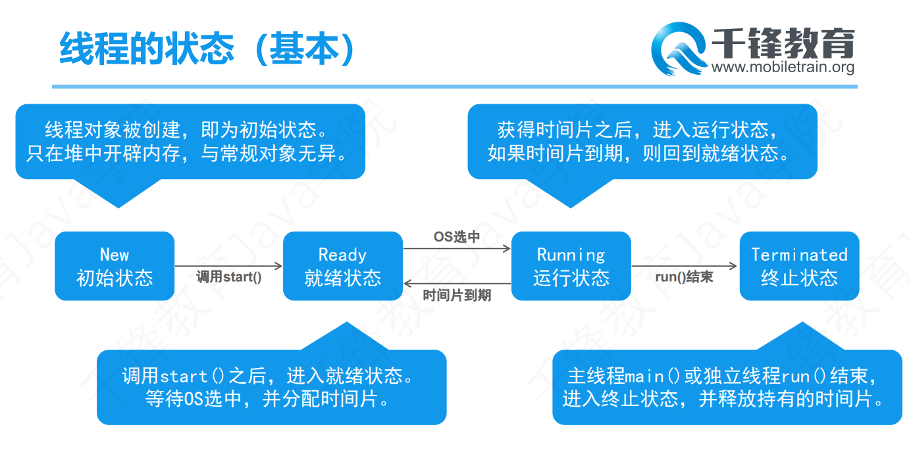
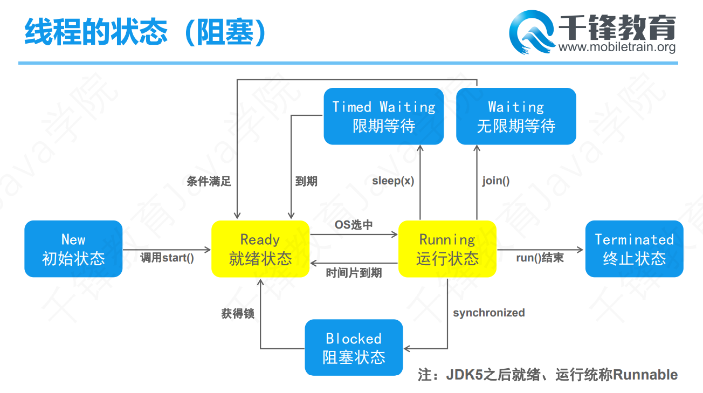

# Day 20笔记

## 一、多线程

### 1.1 概述

* 程序
  * 按照特定顺序组织起来的指令和数据的集合

* 进程
  * 程序运行之后可以成为进程
  * 一个程序运行之后至少一个进程
* 项目
  * ==程序
* 线程
  * 又称轻量级进程
  * 进程的组成，具体执行进程任务
  * 是CPU的基本调度单位
  * 多个线程同时或者交替执行--多线程

### 1.2 线程的组成

* CPU时间片
  * 得到的处理器运算资源
  * 有资格执行
* 数据
  * 堆空间
    * 所有线程共享的数据
  * 栈空间
    * 每条线程独享的数据
* 逻辑代码
  * 线程中具体的代码

### 1.3 创建线程--继承Thread

```
1、创建类,继承Thread
2、重写run方法
3、创建此类的实例
4、调用start方法启动线程
```

```java
package com.qf.thread;

public class Demo02 {
	public static void main(String[] args) {
		// 创建线程实例
		MyThread mt = new MyThread();
		// 调用方法启动线程
		mt.start();
	}
}

/**
 * 	子类继承Thread，重写run方法
 * @author Dushine2008
 */
class MyThread extends Thread{
	@Override
	public void run() {
		for (int i = 0; i < 100; i++) {
			System.out.println("子线程--------------------------------");
		}
	}
}
```

### 1.4 创建线程--实现Runnable接口

```
1、创建类实现Runnable
2、重写run方法
3、创建实现类实例
4、创建Thread实例，把实现类实例当做参数传入
5、调用start方法启动线程
```


```java
package com.qf.thread;

public class Demo04 {
	public static void main(String[] args) {
		// 创建实现类实例
		MyRunnable mr = new MyRunnable();
		// 创建Thread实例，把实现类实例当做构造器的参数传入
		Thread t = new Thread(mr);
		// 调用start方法启动线程
		t.start();
		
		for (int i = 0; i < 100; i++) {
			System.out.println("main线程输出World=============" + i);
		}
	}
}

/**
 * 	创建类实现Runnable
 * 	重写run方法
 * @author Dushine2008
 *
 */
class MyRunnable implements Runnable{

	@Override
	public void run() {
		for (int i = 0; i < 100; i++) {
			System.out.println("子线程执行Hello" + i);
		}
	}
	
}
```

### 1.5 线程状态-基本



### 1.6 线程常用方法（Thread类）

* currentThread
* setName
* getName
* getId

```java
package com.qf.thread;

public class Demo06 {
	public static void main(String[] args) {
		/**
		 *  static Thread currentThread() 
          			返回对当前正在执行的线程对象的引用。 
			void setName(String name) 
		          	改变线程名称，使之与参数 name 相同。 
		    String getName() 
		          	返回该线程的名称。 
            long getId() 
		          	返回该线程的标识符。 
			void join() 
		          	等待该线程终止。
		 	void setDaemon(boolean on) 
		          	将该线程标记为守护线程或用户线程。 
		    int getPriority() 
		          	返回线程的优先级。 
		 	void setPriority(int newPriority) 
		          	更改线程的优先级。 
			static void yield() 
		          	暂停当前正在执行的线程对象，并执行其他线程。 
		 */
		
		MyThread001 mt = new MyThread001();
		// 设置线程名字--最好在线程启动之前设置
		mt.setName("1号线程");
		mt.start();
		
		MyThread001 mt2 = new MyThread001();
		mt2.setName("22号线程");
		mt2.start();
		
		MyThread001 mt3 = new MyThread001();
		mt3.setName("333号线程");
		mt3.start();
		
	}
	
}

class MyThread001 extends Thread{
	@Override
	public void run() {
		for (int i = 0; i < 100; i++) {
			// System.out.println(this.getName() + "正在输出:" + i);
			// System.out.println(Thread.currentThread().getName() + "正在输出:" + i);
			System.out.println(Thread.currentThread().getId() + "正在输出:" + i);
		}
	}
}
```

### 1.7 join方法

* join
  * 插队线程

```java
package com.qf.thread;

public class Demo07 {
	public static void main(String[] args) {
		/**
		 * 	void join() 
		          	等待该线程终止。
		 	void setDaemon(boolean on) 
		          	将该线程标记为守护线程或用户线程。 
		    int getPriority() 
		          	返回线程的优先级。 
		 	void setPriority(int newPriority) 
		          	更改线程的优先级。 
			static void yield() 
		          	暂停当前正在执行的线程对象，并执行其他线程。 
		 */
		
		MyThread002 t = new MyThread002();
		t.start();
		
		for (int i = 0; i < 100; i++) {
			System.out.println(Thread.currentThread().getName() + "输出:" + i);
			if (i == 36) {
				try {
					// 被插队,直到插队的线程执行结束,本线程再次执行
					t.join();
				} catch (InterruptedException e) {
					e.printStackTrace();
				}
			}
		}
	}
}

class MyThread002 extends Thread{
	@Override
	public void run() {
		for (int i = 0; i < 100; i++) {
			System.out.println(Thread.currentThread().getName() + "输出:" + i);
		}
	}
}
```

### 1.8 yield

* 礼让线程---不一定能成功

```Java
package com.qf.thread;

public class Demo08 {
	public static void main(String[] args) {
		/**
		 * static void yield() 
		          	暂停当前正在执行的线程对象，并执行其他线程。 
		    int getPriority() 
		          	返回线程的优先级。 
		 	void setPriority(int newPriority) 
		          	更改线程的优先级。 
		 	void setDaemon(boolean on) 
		          	将该线程标记为守护线程或用户线程。 
		 */
		
		MyThread003 t = new MyThread003();
		t.start();
		
		for (int i = 0; i < 100; i++) {
			System.out.println(Thread.currentThread().getName() + "输出：" + i);
			
			if (i % 10 == 0) {
				// 礼让线程--暂停一下下---马上再次进入争抢CPU的状态
				Thread.yield();
			}
		}
	}
}

class MyThread003 extends Thread{
	@Override
	public void run() {
		for (int i = 0; i < 100; i++) {
			System.out.println(Thread.currentThread().getName() + "输出：" + i);
		}
	}
}
```

### 1.9 线程优先级

* 优先级高的先执行
* 优先级范围1--10

```java
package com.qf.thread;

public class Demo09 {
	public static void main(String[] args) {
		/**
		 *  int getPriority() 
		          	返回线程的优先级。 
		 	void setPriority(int newPriority) 
		          	更改线程的优先级。 
		 	void setDaemon(boolean on) 
		          	将该线程标记为守护线程或用户线程。 
		 */
		
		MyThread004 t = new MyThread004();
		t.setPriority(10);
		t.setName("1号线程");
		t.start();
		
		MyThread004 t1 = new MyThread004();
		t1.setPriority(1);
		t1.setName("2号线程");
		t1.start();
		
	}
}

class MyThread004 extends Thread{
	
	@Override
	public void run() {
		for (int i = 0; i < 100; i++) {
			System.out.println(Thread.currentThread().getName() + "输出：" + i);
		}
	}
	
}
```

### 1.10 守护线程

* 也称为后台线程
* 如果非守护线程全部执行结束，守护线程自动结束

```java
package com.qf.thread;

public class Demo10 {
	public static void main(String[] args) {
		/**
		 * 	void setDaemon(boolean on) 
		          	将该线程标记为守护线程或用户线程。 
		 */
		
		MyThread005 t = new MyThread005();
		t.setName("守护线程");
		t.setDaemon(true);
		t.start();
		
		for (int i = 0; i < 100; i++) {
			System.out.println(Thread.currentThread().getName() + "输出：" + i);
		}
		
	}
}

class MyThread005 extends Thread{
	@Override
	public void run() {
		for (int i = 0; i < 100; i++) {
			System.out.println(Thread.currentThread().getName() + "输出：" + i);
		}
	}
}
```

### 1.11 卖票案例--实现Runnable

```java
package com.qf.thread;

public class Demo11 {
	public static void main(String[] args) {
		/**
		 * 	卖票案例
		 * 
		 * 	车站4个窗口卖票
		 * 
		 * 		1）每个窗口卖出100张票
		 * 		2）四个窗口共同卖出100张票
		 */
		
		TicketRunnable r = new TicketRunnable();
		Thread t1 = new Thread(r, "1号窗口");
		Thread t2 = new Thread(r, "222号窗口");
		Thread t3 = new Thread(r, "33333号窗口");
		Thread t4 = new Thread(r, "44444444号窗口");
		
		t1.start();
		t2.start();
		t3.start();
		t4.start();
		
	}
}


class TicketRunnable implements Runnable{
	int ticket = 100;
	@Override
	public void run() {
		while (true) {
			if (ticket <= 0) {
				break;
			}
			// 222先执行--，ticket=99,；33333抢走线程执行--，ticket=98
			// 1号抢走线程，执行--；ticket=97；4号抢走线程，执行--；ticket=96
			ticket--;
			// 222抢走线程执行输出
			System.out.println(Thread.currentThread().getName() + "卖出了第" + (100-ticket) + "张票,还剩下" + ticket);
		}
	}
}
```

### 1.12 卖票案例--继承Thread

```java
package com.qf.safe;

public class Demo01 {
	public static void main(String[] args) {
		/**
		 * 	卖票案例
		 * 	车站4个窗口卖票
		 * 		1）每个窗口卖出100张票
		 * 		2）四个窗口共同卖出100张票
		 */
		
		TicketThread t1 = new TicketThread();
		TicketThread t2 = new TicketThread();
		TicketThread t3 = new TicketThread();
		TicketThread t4 = new TicketThread();
		
		t1.setName("1号窗口");
		t2.setName("2号窗口");
		t3.setName("3号窗口");
		t4.setName("4号窗口");
		
		t1.start();
		t2.start();
		t3.start();
		t4.start();
		
	}
}

class TicketThread extends Thread{
	static int ticket = 100;
	@Override
	public void run() {
		while (true) {
			// 如果没有票,终止循环
			if (ticket <= 0) {
				break;
			}
			
			ticket--;
			System.out.println(Thread.currentThread().getName() + "卖出了第" + (100-ticket) + "张票,还剩下" + ticket);
		}
	}
}
```

## 二、线程安全

### 2.1 问题产生的原因

* 共享资源被多条线程并发修改，可能出现问题
  * 共享资源：多条线程共同拥有、操作的数据
* 没有保证原子操作
  * 原子操作：多步操作应该是一个整体，要么都成功，如果有一步失败，整体失败

### 2.2 多线程修改数组

```java
package com.qf.safe;

public class Demo01 {
	public static void main(String[] args) {
		/**
		 * 	卖票案例
		 * 	车站4个窗口卖票
		 * 		1）每个窗口卖出100张票
		 * 		2）四个窗口共同卖出100张票
		 */
		
		TicketThread t1 = new TicketThread();
		TicketThread t2 = new TicketThread();
		TicketThread t3 = new TicketThread();
		TicketThread t4 = new TicketThread();
		
		t1.setName("1号窗口");
		t2.setName("2号窗口");
		t3.setName("3号窗口");
		t4.setName("4号窗口");
		
		t1.start();
		t2.start();
		t3.start();
		t4.start();
		
	}
}

class TicketThread extends Thread{
	static int ticket = 100;
	@Override
	public void run() {
		while (true) {
			// 如果没有票,终止循环
			if (ticket <= 0) {
				break;
			}
			
			ticket--;
			System.out.println(Thread.currentThread().getName() + "卖出了第" + (100-ticket) + "张票,还剩下" + ticket);
		}
	}
}
```

### 2.3 卖票安全的线程

```java
package com.qf.safe.ticket;

/**
 * 	卖票的Runnable实现类
 * @author Dushine2008
 *
 */
public class TicketRunnable implements Runnable {
	int ticket = 100;
	@Override
	public void run() {
		while (true) {
			// 把原子操作放入同步代码块
			synchronized (Object.class) {
				if (ticket <= 0) {
					break;
				}
				
				ticket--;
				System.out.println(Thread.currentThread().getName() + "卖出了第" + (100-ticket) + "张票,还剩下" + ticket);
			}
		}
	}
}
```

* 测试类

```java
package com.qf.safe.ticket;

public class Demo01 {
	public static void main(String[] args) {
		/**
		 * 	解决多线程卖票的安全问题
		 */
		
		TicketRunnable r = new TicketRunnable();
		
		Thread t1 = new Thread(r, "1号窗口");
		Thread t2 = new Thread(r, "2号窗口");
		Thread t3 = new Thread(r, "3号窗口");
		Thread t4 = new Thread(r, "4号窗口");
		
		t1.start();
		t2.start();
		t3.start();
		t4.start();
	}
}
```

### 2.4 死锁

* 线程一和线程二需要锁对象A和B
* 线程一获取到了A锁，等待获取B锁
* 线程二获取到了B锁，等待获取A锁
* 进入无穷等到--死锁

#### LockObject

```java
package com.qf.safe.deadlock;

/**
 * 	两个对象锁
 * 	同时获取才能执行代码
 * @author Dushine2008
 *
 */
public class LockObject {
	public static Object lockA = new Object();
	public static Object lockB = new Object();
}
```

#### BB01

```java
package com.qf.safe.deadlock;

/**
 * 	冰冰线程
 * @author Dushine2008
 *
 */
public class BB01 extends Thread {
	@Override
	public void run() {
		synchronized (LockObject.lockA) {
			System.out.println("冰冰拿到了筷子A,正在尝试获取筷子B...");
			synchronized (LockObject.lockB) {
				System.out.println("冰冰获取到了筷子A和B,可以开动啦啦啦啦");
			}
		}
	}
}
```

#### CC01

```java
package com.qf.safe.deadlock;

/**
 * 	晨晨线程
 * @author Dushine2008
 */
public class CC01 extends Thread {
	@Override
	public void run() {
		synchronized (LockObject.lockB) {
			System.out.println("晨晨拿到了筷子B,正在尝试获取筷子A...");
			synchronized (LockObject.lockA) {
				System.out.println("晨晨获取到了筷子A和B,可以开动啦啦啦啦");
			}
		}
	}
}
```

#### 测试类

```java
package com.qf.safe.deadlock;

public class Demo01 {
	public static void main(String[] args) {
		BB01 bb = new BB01();
		CC01 cc = new CC01();
		
		bb.start();
		cc.start();
	}
}
```


## 三、线程状态

### 3.1 概述

* 线程在特定瞬间的状态
* 在给定时间点上，一个线程只能处于一种状态。

### ==3.2 线程的状态==

- [`NEW`](../../java/lang/Thread.State.html#NEW)
  至今尚未启动的线程处于这种状态。   
- [`RUNNABLE`](../../java/lang/Thread.State.html#RUNNABLE)
  正在  Java 虚拟机中执行的线程处于这种状态。  
- [`BLOCKED`](../../java/lang/Thread.State.html#BLOCKED)
  受阻塞并等待某个监视器锁的线程处于这种状态。   
- [`WAITING`](../../java/lang/Thread.State.html#WAITING)
  无限期地等待另一个线程来执行某一特定操作的线程处于这种状态。   
- [`TIMED_WAITING`](../../java/lang/Thread.State.html#TIMED_WAITING)
  等待另一个线程来执行取决于指定等待时间的操作的线程处于这种状态。   
- [`TERMINATED`](../../java/lang/Thread.State.html#TERMINATED)
  已退出的线程处于这种状态。  



## 四、冰冰和晨晨的故事

### Card类

```java
package com.qf.trans;

/**
 * 	卡
 * 	BB线程和CC线程共同操作
 * @author Dushine2008
 *
 */
public class Card {
	private int money = 0;

	public int getMoney() {
		return money;
	}

	public void setMoney(int money) {
		this.money = money;
	}

	@Override
	public String toString() {
		return "Card [money=" + money + "]";
	}
	
}
```

### BB

```java
package com.qf.trans;

/**
 * 	消费的线程
 * @author Dushine2008
 *
 */
public class BB extends Thread {
	
	Card card;
	
	public BB(Card card) {
		super();
		this.card = card;
	}

	@Override
	public void run() {
		for (int i = 1; i <= 12; i++) {
			// 取出
			card.setMoney(card.getMoney()-5000);
			System.out.println("冰冰取出5000,剩余" + card.getMoney());
		}
	}
}
```

### CC

```java
package com.qf.trans;

/**
 * 	生产的线程
 * @author Dushine2008
 *
 */
public class CC extends Thread {
	
	Card card;
	
	public CC(Card card) {
		super();
		this.card = card;
	}

	@Override
	public void run() {
		for (int i = 1; i <= 12; i++) {
			// 取出
			card.setMoney(card.getMoney()+5000);
			System.out.println("晨晨存入5000,剩余" + card.getMoney());
		}
	}
}
```

### Demo01

```java
package com.qf.trans;

public class Demo01 {
	public static void main(String[] args) {
		Card card = new Card();
		BB bb = new BB(card);
		CC cc = new CC(card);
		
		bb.start();
		cc.start();
	}
}
```

### 存在问题

* 没钱也能取
* 线程不同步
* 毫无秩序

## 五、冰冰和晨晨的故事02

### Card

```java
package com.qf.trans02;

/**
 * 	卡
 * 	BB线程和CC线程共同操作
 * @author Dushine2008
 *
 */
public class Card {
	private int money = 0;

	public int getMoney() {
		return money;
	}

	public void setMoney(int money) {
		this.money = money;
	}

	@Override
	public String toString() {
		return "Card [money=" + money + "]";
	}
	
}
```

### BB

```java
package com.qf.trans02;

/**
 * 	消费的线程
 * @author Dushine2008
 * 
 * 	解决了余额不足扔可以取的问题
 * 	加入了同步代码块
 *
 */
public class BB extends Thread {
	Card card;
	
	public BB(Card card) {
		this.card = card;
	}
	
	@Override
	public void run() {
		for (int i = 1; i <= 12; i++) {
			synchronized (card) {
				if (card.getMoney() > 0) {
					card.setMoney(card.getMoney()-5000);
					System.out.println("冰冰取出了5000,剩余" + card.getMoney());
				} else {
					System.out.println("余额不足...");
					i--;
				}
			}
		}
	}
}

```

### CC

```java
package com.qf.trans02;

/**
 * 	生产的线程
 * @author Dushine2008
 * 
 * 	加入了同步代码块
 *
 */
public class CC extends Thread {
	Card card;
	
	public CC(Card card) {
		this.card = card;
	}
	
	@Override
	public void run() {
		for (int i = 1; i <= 12; i++) {
			synchronized (card) {
				card.setMoney(card.getMoney()+5000);
				System.out.println("晨晨存入了5000,剩余" + card.getMoney());
			}
		}
	}
}
```

### Demo01

```java
package com.qf.trans02;

public class Demo01 {
	public static void main(String[] args) {
		Card card = new Card();
		
		BB bb = new BB(card);
		CC cc = new CC(card);
		
		bb.start();
		cc.start();
	}
}
```

### 存在问题

* 毫无秩序

## 六、冰冰和晨晨的故事03

### Card

```java
package com.qf.trans03;

/**
 * 	卡
 * 	BB线程和CC线程共同操作
 * @author Dushine2008
 *
 */
public class Card {
	private int money = 0;
	// 卡里是否有钱的标记
	private boolean flag = false;
	
	/**
	 * 	存款的方法
	 */
	public synchronized void take() {
		// 判断flag是否能取
		if (flag == false) {
			try {
				this.wait();
				Thread.sleep(300);
			} catch (InterruptedException e) {
				e.printStackTrace();
			}
		}
		
		// flag是true,可以取
		this.money -= 5000;
		System.out.println("冰冰取出了5000,剩余" + this.money);
		flag = false;
		this.notify();
		
	}
	
	/**
	 * 	存款的方法
	 */
	public synchronized void save() {
		// 判断flag，决定能不能存
		if (flag == true) {
			try {
				this.wait();
				Thread.sleep(300);
			} catch (InterruptedException e) {
				e.printStackTrace();
			}
		}
		
		// flag==false，可以存
		this.money += 5000;
		System.out.println("晨晨存入了5000,剩余" + this.money);
		flag = true;
		this.notify();
	}
	
}
```

### BB

```java
package com.qf.trans03;

/**
 * 	消费的线程
 * @author Dushine2008
 * 
 * 	解决了余额不足扔可以取的问题
 * 	加入了同步代码块
 *
 */
public class BB extends Thread {
	Card card;
	
	public BB(Card card) {
		this.card = card;
	}
	
	@Override
	public void run() {
		for (int i = 1; i <= 12; i++) {
			card.take();
		}
	}
}
```

### CC

```java
package com.qf.trans03;

/**
 * 	生产的线程
 * @author Dushine2008
 * 
 * 	加入了同步代码块
 *
 */
public class CC extends Thread {
	Card card;
	
	public CC(Card card) {
		this.card = card;
	}
	
	@Override
	public void run() {
		for (int i = 1; i <= 12; i++) {
			card.save();
		}
	}
}
```

### Demo01

```java
package com.qf.trans03;

public class Demo01 {
	public static void main(String[] args) {
		Card card = new Card();
		
		BB bb = new BB(card);
		CC cc = new CC(card);
		
		bb.start();
		cc.start();
	}
}
```


## 七、关于Synchronized（）参数说明

同一时间只能有一个线程可以访问synchronized块内的内容，本质是一把锁，（参数）规定了锁的类型，可以是对象或者类的锁，说白了这个参数决定的是这把锁的作用范围。

```
//说明：
class 人
人 你 = new 人（）；
人 我 = new 人（）；

如果是
synchronized(你){
吃饭();
}
那么说明你只能一顿一顿吃，不能同时（多线程）吃好几顿饭；

如果是
synchronized（人.class){
吃饭（）；
}
那么只要我在吃饭，你就不能吃饭，得等我吃完！
```


