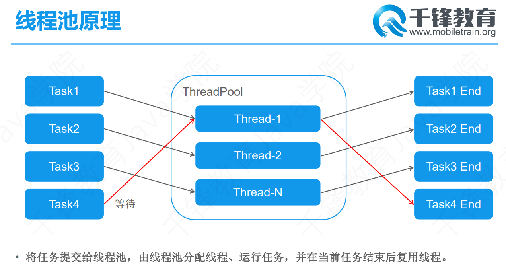
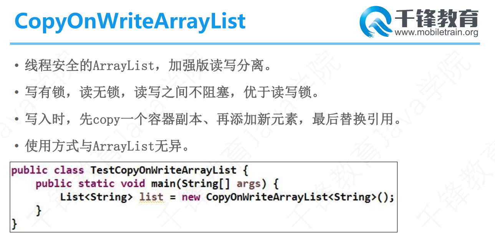
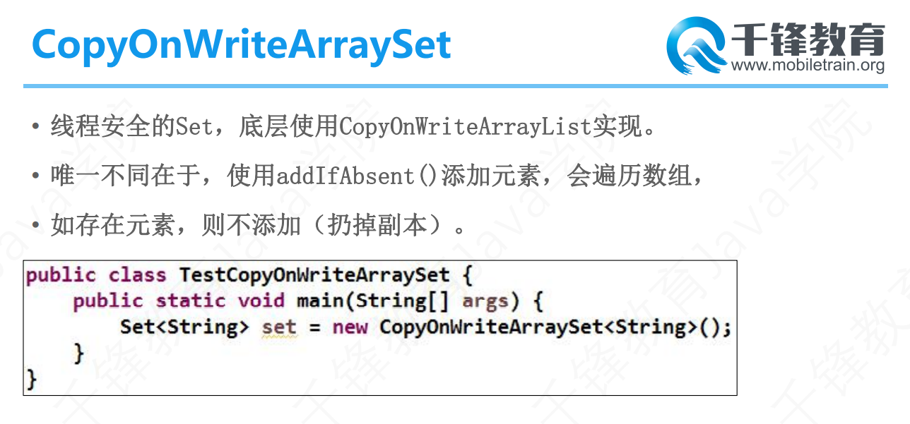
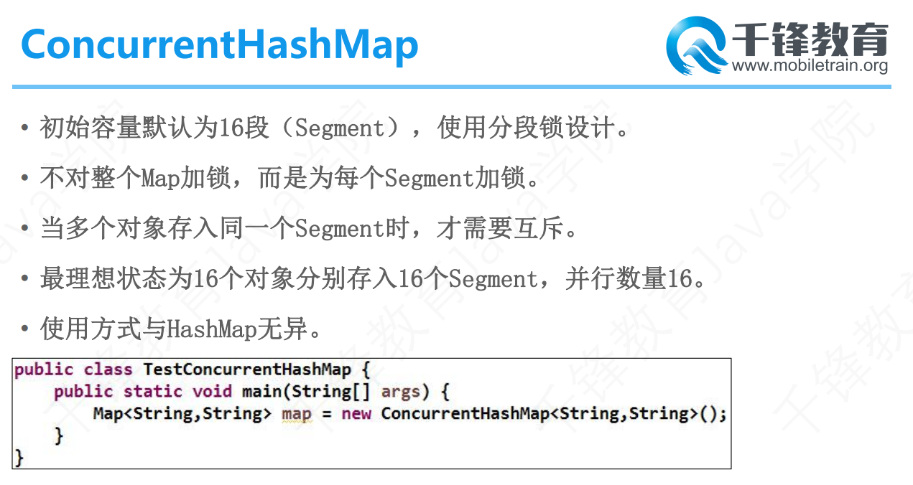
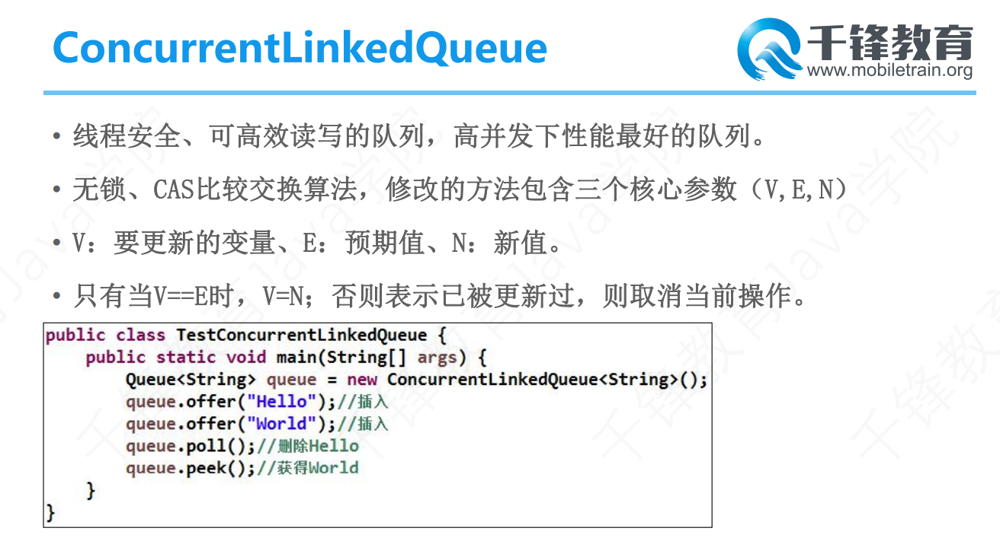

# 	Day 21笔记

### 一、线程池

### 1.1 概述

* 线程是宝贵的资源，频繁的创建和销毁会消耗大量的资源
* 线程池预设线程的数量，线程任务结束后，线程重复使用
* 避免了频繁创建和销毁，节省内存和处理器资源

### 1.2 频繁创建线程

```java
package com.qf.pool;

public class Demo01 {
	public static void main(String[] args) {
		for (int i = 0; i < Integer.MAX_VALUE; i++) {
			new Thread(new Runnable() {
				
				@Override
				public void run() {
					for (int j = 0; j < 1000; j++) {
						System.out.println(j);
						try {
							Thread.sleep(1000);
						} catch (InterruptedException e) {
							e.printStackTrace();
						}
					}
				}
			}).start();
		}
	}
}
```

### 1.3 线程池工作原理



### 1.4 线程池核心API

#### Executor

* 线程池顶级接口

* 执行已提交的 [`Runnable`](../../../java/lang/Runnable.html) 任务的对象。
* 此接口提供一种将任务提交与每个任务将如何运行的机制（包括线程使用的细节、调度等）分离开来的方法。
* 通常使用 `Executor` 而不是显式地创建线程。
* 此包中提供的 `Executor` 实现实现了 [`ExecutorService`](../../../java/util/concurrent/ExecutorService.html)，这是一个使用更广泛的接口。
* [`Executors`](../../../java/util/concurrent/Executors.html) 类为这些 Executor 提供了便捷的工厂方法。 

#### Executors

* 此包中所定义的 [`Executor`](../../../java/util/concurrent/Executor.html)、[`ExecutorService`](../../../java/util/concurrent/ExecutorService.html)、[`ScheduledExecutorService`](../../../java/util/concurrent/ScheduledExecutorService.html)、[`ThreadFactory`](../../../java/util/concurrent/ThreadFactory.html) 
  和 [`Callable`](../../../java/util/concurrent/Callable.html) 类的工厂和实用方法
* 创建并返回设置有常用配置字符串的 [`ExecutorService`](../../../java/util/concurrent/ExecutorService.html)  的方法。  
* 创建并返回设置有常用配置字符串的 [`ScheduledExecutorService`](../../../java/util/concurrent/ScheduledExecutorService.html)  的方法。  
* 创建并返回“包装的”ExecutorService 方法，它通过使特定于实现的方法不可访问来禁用重新配置。  
* 创建并返回 [`ThreadFactory`](../../../java/util/concurrent/ThreadFactory.html)  的方法，它可将新创建的线程设置为已知的状态。  
* 创建并返回非闭包形式的 [`Callable`](../../../java/util/concurrent/Callable.html)  的方法，这样可将其用于需要 `Callable` 的执行方法中。
*  `**newCachedThreadPool**()`             
  * 创建一个可根据需要创建新线程的线程池，但是在以前构造的线程可用时将重用它们。
*  `**newFixedThreadPool**(int nThreads)`             
  * 创建一个可重用固定线程数的线程池，以共享的无界队列方式来运行这些线程。
*  `**newScheduledThreadPool**(int corePoolSize)`             
  * 创建一个线程池，它可安排在给定延迟后运行命令或者定期地执行。
*  `**newSingleThreadExecutor**()`            
  * 创建一个使用单个 worker 线程的 Executor，以无界队列方式来运行该线程。

#### ExecutorService

* 线程池对象
* 能提交任务、结束任务、判断任务状态、获取任务结果
* [`Executor`](../../../java/util/concurrent/Executor.html) 提供了管理终止的方法，以及可为跟踪一个或多个异步任务执行状况而生成 [`Future`](../../../java/util/concurrent/Future.html) 的方法。

#### Callable

* 返回结果并且可能抛出异常的任务。
* 实现者定义了一个不带任何参数的叫做 `call` 的方法。  
  * `Callable` 接口类似于 [`Runnable`](../../../java/lang/Runnable.html)，两者都是为那些其实例可能被另一个线程执行的类设计的。
* 但是  `Runnable` 不会返回结果，并且无法抛出经过检查的异常。 

#### Future

* `Future` 表示异步计算的结果。
* 它提供了检查计算是否完成的方法，以等待计算的完成，并获取计算的结果。
* 计算完成后只能使用 `get` 方法来获取结果，如有必要，计算完成前可以阻塞此方法。

### 1.5 创建线程池&提交任务

```java
package com.qf.pool;

import java.util.concurrent.ExecutorService;
import java.util.concurrent.Executors;

public class Demo02 {
	public static void main(String[] args) {
		// 创建线程池对象
		ExecutorService es = Executors.newFixedThreadPool(4);
		System.out.println(es);
		
		// 提交线程任务
		for (int i = 0; i < 20; i++) {
			es.submit(new Runnable() {
				@Override
				public void run() {
					System.out.println(Thread.currentThread().getName());
				}
			});
		}
		System.out.println(es);
		// 启动顺序关闭
		es.shutdown();
		for (int i = 0; i < 10; i++) {
			System.out.println(es);
		}
		
	}
}
```

### 1.6 提交多个不同任务

```java
package com.qf.pool;

import java.util.concurrent.ExecutorService;
import java.util.concurrent.Executors;

public class Demo03 {
	public static void main(String[] args) {
		// 创建线程池
		ExecutorService es = Executors.newFixedThreadPool(2);
		
		// 提交任务:输出0--5000
		es.submit(new Runnable() {
			@Override
			public void run() {
				for (int i = 0; i < 5000; i++) {
					System.out.println(i);
					try {
						Thread.sleep(1);
					} catch (InterruptedException e) {
						e.printStackTrace();
					}
				}
			}
		});
		
		// 提交任务:输出5000--10000
		es.submit(new Runnable() {
			@Override
			public void run() {
				for (int i = 5000; i < 10000; i++) {
					System.out.println(i);
					try {
						Thread.sleep(1);
					} catch (InterruptedException e) {
						e.printStackTrace();
					}
				}
			}
		});
		// 启动顺序关闭
		es.shutdown();
	}
}
```

### 1.7 带有返回值的任务

```java
package com.qf.pool;

import java.util.concurrent.Callable;
import java.util.concurrent.ExecutionException;
import java.util.concurrent.ExecutorService;
import java.util.concurrent.Executors;
import java.util.concurrent.Future;

public class Demo04 {
	public static void main(String[] args) throws InterruptedException, ExecutionException {
		// 创建任务对象
		MyCallable mc = new MyCallable();
		
		// 创建线程池
		ExecutorService es = Executors.newFixedThreadPool(2);
		
		// 获取Future对象,包含即将获取的结果
		Future<Integer> f1 = es.submit(mc);
		
		// 启动顺序关闭
		es.shutdown();
		
		// 获取结果
		Integer sum = f1.get();
		System.out.println(sum);
		
	}
}

/**
 * 	定义Callable的实现类
 * @author Dushine2008
 *
 */
class MyCallable implements Callable<Integer>{

	Integer sum = 0;
	@Override
	public Integer call() throws Exception {
		for (int i = 0; i <= 100; i++) {
			sum += i;
		}
		return sum;
	}
	
}
```

### 1.8 提交多个有返回值的任务

```java
package com.qf.pool;

import java.util.concurrent.Callable;
import java.util.concurrent.ExecutionException;
import java.util.concurrent.ExecutorService;
import java.util.concurrent.Executors;
import java.util.concurrent.Future;

public class Demo05 {
	public static void main(String[] args) throws InterruptedException, ExecutionException {
		/**
		 * 	开启四条线程计算1---10000累加的结果
		 */
		
		// 创建线程池对象
		ExecutorService es = Executors.newFixedThreadPool(4);
		
		// 创建任务
		GetSumCallable c1 = new GetSumCallable(0, 2500);
		GetSumCallable c2 = new GetSumCallable(2501, 5000);
		GetSumCallable c3 = new GetSumCallable(5001, 7500);
		GetSumCallable c4 = new GetSumCallable(7501, 10000);
		
		// 提交任务
		Future<Integer> f1 = es.submit(c1);
		Future<Integer> f2 = es.submit(c2);
		Future<Integer> f3 = es.submit(c3);
		Future<Integer> f4 = es.submit(c4);
		
		// 启动顺序关闭
		es.shutdown();
		
		// 获取结果
		Integer sum = f1.get() + f2.get() + f3.get() + f4.get();
		
		System.out.println(sum);
	}
}

/**
 * 	计算start累加到end结果的任务
 * @author Dushine2008
 *
 */
class GetSumCallable implements Callable<Integer>{
	private int start;
	private int end;
	int sum = 0;
	
	public GetSumCallable(int start, int end) {
		super();
		this.start = start;
		this.end = end;
	}
	
	@Override
	public Integer call() throws Exception {
		
		for (int i = start; i <= end; i++) {
			sum += i;
		}
		return sum;
	}
	
}
```

## 二、Lock

### 2.1 概述

* `Lock` 实现提供了比使用 `synchronized` 方法和语句可获得的更广泛的锁定操作。
* 锁是控制多个线程对共享资源进行访问的工具。
* 通常，锁提供了对共享资源的独占访问。
* 一次只能有一个线程获得锁，对共享资源的所有访问都需要首先获得锁。
* 不过，某些锁可能允许对共享资源并发访问，如 [`ReadWriteLock`](../../../../java/util/concurrent/locks/ReadWriteLock.html) 的读取锁。 

### 2.2 实现类

* ReentrantLock
* ReentrantReadWriteLock.ReadLock
* ReentrantReadWriteLock.WriteLock 

### 2.3 常用方法

* lock
* unLock

## 三、ReentrantLock

### 3.1 概述

* 一个可重入的互斥锁 [`Lock`](../../../../java/util/concurrent/locks/Lock.html)，它具有与使用  `synchronized` 方法和语句所访问的隐式监视器锁相同的一些基本行为和语义，但功能更强大。 
* `ReentrantLock`  将由最近成功获得锁，并且还没有释放该锁的线程所*拥有*。
* 当锁没有被另一个线程所拥有时，调用 `lock`  的线程将成功获取该锁并返回。
* unLock方法一定要在finally代码块中调用---如果获取了锁，就必须释放锁

### 3.2 创建对象

```
ReentrantLock()      			——构造方法
          创建一个 ReentrantLock 的实例。 
ReentrantLock(boolean fair)  	——构造方法
          创建一个具有给定公平策略的 ReentrantLock。 
```

### 3.3 ReentrantLock案例

#### ArrSrc

```java
package com.qf.lock;

import java.util.Arrays;
import java.util.concurrent.locks.ReentrantLock;

/**
 * 	数组资源类
 * @author Dushine2008
 *
 */
public class ArrSrc {
	private String[] arr = new String[5];
	private int index = 0;
	
	// 创建ReentrantLock对象
	ReentrantLock lock = new ReentrantLock();
	
	/**
	 * 	修改数组内容的方法
	 * @param str
	 */
	public void addStr(String str) {
		// 修改之前上锁
		lock.lock();
		try {
			arr[index] = str;
			index++;
		} finally {
			// 如果获取了锁必须解锁
			lock.unlock();
		}
	}
	
	@Override
	public String toString() {
		return "ArrSrc [arr=" + Arrays.toString(arr) + ", index=" + index + "]";
	}
}
```

#### TA01

```java
package com.qf.lock;

/**
 * 	修改数组的线程01
 * @author Dushine2008
 *
 */
public class TA01 extends Thread {

	ArrSrc arrSrc;

	public TA01(ArrSrc arrSrc) {
		super();
		this.arrSrc = arrSrc;
	}

	@Override
	public void run() {
		arrSrc.addStr("Hello");
	}
}
```

#### TA02

```java
package com.qf.lock;

/**
 * 	修改数组的线程02
 * @author Dushine2008
 *
 */
public class TA02 extends Thread {

	ArrSrc arrSrc;

	public TA02(ArrSrc arrSrc) {
		super();
		this.arrSrc = arrSrc;
	}

	@Override
	public void run() {
		arrSrc.addStr("World");
	}
}
```

#### Demo01

```java
package com.qf.lock;

public class Demo01 {
	public static void main(String[] args) {
		ArrSrc arrSrc = new ArrSrc();
		// 创建线程
		TA01 t01 = new TA01(arrSrc);
		TA02 t02 = new TA02(arrSrc);
		
		// 启动线程
		t01.start();
		t02.start();
		
		// 保证修改数组的线程先结束
		try {
			t01.join();
			t02.join();
		} catch (InterruptedException e) {
			e.printStackTrace();
		}
		
		// 输出修改之后的数组
		System.out.println(arrSrc);
	}
}
```

## 四、读写锁

### 4.1 概述

* 对线程中读取和写入等涉及修改的操作单独上锁
* 读--读
  * 不互斥，不阻塞
* 读--写
  * 互斥，阻塞
* 写--写
  * 互斥，阻塞

### 4.2 内部类

* ReentrantReadWriteLock.ReadLock
  * 读锁
  * 读取数据不互斥、不阻塞
* ReentrantReadWriteLock.WriteLock
  * 写锁
  * 涉及到数据改变的操作互斥、阻塞

### 4.3 创建对象

* 调用外部类的方法获取对象

```java
package com.qf.lock03;

import java.util.concurrent.locks.ReentrantReadWriteLock;
import java.util.concurrent.locks.ReentrantReadWriteLock.ReadLock;
import java.util.concurrent.locks.ReentrantReadWriteLock.WriteLock;

public class Demo01 {
	public static void main(String[] args) {
		ReentrantReadWriteLock readWriteLock = new ReentrantReadWriteLock();
        //readWriteLock是ReentrantReadWriteLock的子接口
		ReadLock readLock = readWriteLock.readLock();    
        
		WriteLock writeLock = readWriteLock.writeLock();
	}
}
```

### 4.4 案例

#### MyClass---ReentrantLock

```java
package com.qf.lock03;

import java.util.concurrent.locks.ReentrantLock;

public class MyClass{
	private String value;
	// 创建锁对象
	ReentrantLock lock = new ReentrantLock();

	/**
	 * 	读取数据
	 * @return
	 */
	public String getValue() {
		lock.lock();
		try {
			Thread.sleep(1000);
			return value;
		} catch (InterruptedException e) {
			e.printStackTrace();
		} finally {
			lock.unlock();
		}
		return value;
	}

	/**
	 * 	设置value的值
	 * @param value
	 */
	public void setValue(String value) {
		lock.lock();
		try {
			Thread.sleep(1000);
			this.value = value;
		} catch (InterruptedException e) {
			e.printStackTrace();
		} finally {
			lock.unlock();
		}
	}

	@Override
	public String toString() {
		return "MyClass [value=" + value + "]";
	}
	
}
```

#### Demo02

```java
package com.qf.lock04;

import java.util.concurrent.ExecutorService;
import java.util.concurrent.Executors;

public class Demo02 {
	public static void main(String[] args) {
		/**
		 * 	编写类，创建对象
		 * 	在类中定义set和get方法
		 * 	分别使用ReentrantLock和ReentrantReadWriteLock，PK他们的效率
		 */
		// 开始的时间
		long startTime = System.currentTimeMillis();
		
		MyClass mc = new MyClass();
		
		// 创建线程池
		ExecutorService es = Executors.newFixedThreadPool(20);
		
		// 提交任务18条读取的任务和2条设置的任务
		for (int i = 0; i < 2; i++) {
			es.submit(new Runnable() {
				@Override
				public void run() {
					mc.setValue(Math.random() + "===");
				}
			});
		}
		
		for (int i = 0; i < 18; i++) {
			es.submit(new Runnable() {
				@Override
				public void run() {
					mc.getValue();
				}
			});
		}
		
		// 启动
		es.shutdown();
		
		// 统计总时间,最后执行此行代码
		
		// 如果线程没有完全结束,此处阻塞
		while (!es.isTerminated()) {}
		
		System.out.println(System.currentTimeMillis() - startTime);
		
	}
}
```

#### MyClass----ReentrantReadWriteLock

```java
package com.qf.lock04;

import java.util.concurrent.locks.ReentrantReadWriteLock;
import java.util.concurrent.locks.ReentrantReadWriteLock.ReadLock;
import java.util.concurrent.locks.ReentrantReadWriteLock.WriteLock;

public class MyClass{
	private String value;
	ReentrantReadWriteLock readWriteLock = new ReentrantReadWriteLock();
	// 获取读锁和写锁
	ReadLock readLock = readWriteLock.readLock();
	WriteLock writeLock = readWriteLock.writeLock();

	/**
	 * 	读取数据
	 * @return
	 */
	public String getValue() {
		readLock.lock();
		try {
			Thread.sleep(1000);
			return value;
		} catch (InterruptedException e) {
			e.printStackTrace();
		} finally {
			readLock.unlock();
		}
		return value;
	}

	/**
	 * 	设置value的值
	 * @param value
	 */
	public void setValue(String value) {
		writeLock.lock();
		try {
			Thread.sleep(1000);
			this.value = value;
		} catch (InterruptedException e) {
			e.printStackTrace();
		} finally {
			writeLock.unlock();
		}
	}

	@Override
	public String toString() {
		return "MyClass [value=" + value + "]";
	}
	
}
```

## 五、线程安全的集合

### 5.1 ArrayList可能出现的问题

```java
package com.qf.coll;

import java.util.ArrayList;

/**
 * ArrayList是线程不安全的
 * @author Dushine2008
 *
 */
public class Demo01 {
	public static void main(String[] args) {
		ArrayList<String> list = new ArrayList<String>();
		
		for (int i = 0; i < 20; i++) {
			new Thread(new Runnable() {
				
				@Override
				public void run() {
					for (int j = 0; j < 100; j++) {
						try {
							list.add(Math.random() + "===" + j);
							System.out.println(list);
						} catch (Exception e) {
							e.printStackTrace();
							System.exit(0);
						}
					}
				}
			}).start();
		}
	}
}
```

### 5.2 Collections提供的同步方法

```java
package com.qf.coll;

import java.util.ArrayList;
import java.util.Collections;
import java.util.List;

/**
 * 	使用集合工具类把ArrayList包装成线程安全的对象
 * @author Dushine2008
 *
 */
public class Demo02 {
	public static void main(String[] args) {
		ArrayList<String> list = new ArrayList<String>();
		List<String> synchronizedList = Collections.synchronizedList(list);
		
		for (int i = 0; i < 20; i++) {
			new Thread(new Runnable() {
				
				@Override
				public void run() {
					for (int j = 0; j < 100; j++) {
						try {
                                synchronizedList.add(Math.random() + "====" +j);
							System.out.println(synchronizedList);
						} catch (Exception e) {
							e.printStackTrace();
							System.exit(0);
						}
					}
				}
			}).start();
		}
		
	}
}
```

### 5.3 CopyOnWriteArrayList



```java
package com.qf.coll;

import java.util.concurrent.CopyOnWriteArrayList;

public class Demo03 {
	public static void main(String[] args) {
		CopyOnWriteArrayList<String> list = new CopyOnWriteArrayList<String>();
		
		for (int i = 0; i < 20; i++) {
			new Thread(new Runnable() {
				@Override
				public void run() {
					for (int j = 0; j < 100; j++) {
						try {
							list.add(Math.random() + "============" + j);
							System.out.println(list);
						} catch (Exception e) {
							e.printStackTrace();
							System.exit(0);
						}
					}
				}
			}).start();
		}
	}
}
```

### 5.4 CopyOnWriteArraySet



### 5.5 ConcurrentHashMap

* HashMap
  * JDK1.2加入
  * 实现了Map接口，继承了AbstractMap
  * 所有的方法没有同步、没有锁
  * 线程不安全
* HashTable
  * JDK1.0加入，从1.2加入[Java Collections  Framework](../../../technotes/guides/collections/index.html) 
  * 实现类Map接口，继承了Dictionary类
  * HashTable中的方法基本都是使用同步的方式保证线程安全
* ConcurrentHashMap
  * jdk1.7
  * jdk1.8
  * 涉及到修改数据的方法都使用了同步方法或者代码块
  * 线程安全



## 六、Queue

### 6.1 概述

* 队列
* 先进先出--FIFO
* 在处理元素前用于保存元素的 collection。
* 除了基本的 [`Collection`](../../java/util/Collection.html) 操作外，队列还提供其他的插入、提取和检查操作。
* 每个方法都存在两种形式：
  * 一种抛出异常（操作失败时），
  * 另一种返回一个特殊值（`null` 或 `false`，具体取决于操作）。
* 队列通常（但并非一定）以 FIFO（先进先出）的方式排序各个元素。

### 6.2 实现类--ConcurrentLinkedQueue

* 概述
  * 一个基于链接节点的无界线程安全[队列](../../../java/util/Queue.html)。
  * 此队列按照 FIFO（先进先出）原则对元素进行排序。
  * 队列的*头部* 是队列中时间最长的元素。
  * 队列的*尾部* 是队列中时间最短的元素。
  * 新的元素插入到队列的尾部，队列获取操作从队列头部获得元素。
  * 当多个线程共享访问一个公共 collection 时，`ConcurrentLinkedQueue` 是一个恰当的选择。
  * 此队列不允许使用 `null` 元素。 



### 6.3 BlockingQueue

* 支持两个附加操作的 [`Queue`](../../../java/util/Queue.html)，这两个操作是：
  * 获取元素时，如果队列为空，则等待队列变为非空
  * 存储元素时，如果队列不可用，则等待空间变得可用
* 实现类
  * ArrayBlockingQueue
  * LinkedBlockingQueue
* 方法
  * take
    * 没有元素时候等待
  * put
    * 元素满了的时候等待
* 使用
  * 可以用来实现生产者和消费者模式

### 6.4 ArrayBlockingQueue

* 一个由数组支持的有界[阻塞队列](../../../java/util/concurrent/BlockingQueue.html)。
* 此队列按 FIFO（先进先出）原则对元素进行排序。
* 队列的*头部* 是在队列中存在时间最长的元素。
* 队列的*尾部* 是在队列中存在时间最短的元素。
* 新元素插入到队列的尾部，队列获取操作则是从队列头部开始获得元素。 

```java
package com.qf.coll;

import java.util.concurrent.ArrayBlockingQueue;

public class Demo07 {
	public static void main(String[] args) {
		ArrayBlockingQueue<String> queue = new ArrayBlockingQueue<String>(4);
		// 存数据的线程
		new Thread(new Runnable() {
			@Override
			public void run() {
				for (int i = 0; i < 100; i++) {
					try {
						queue.put(Math.random() + "====");
						Thread.sleep(50);
					} catch (InterruptedException e) {
						e.printStackTrace();
					}
				}
			}
		}).start();
		
		// 存数据的线程
		new Thread(new Runnable() {
			@Override
			public void run() {
				for (int i = 0; i < 100; i++) {
					try {
						System.out.println(queue.take());
						Thread.sleep(50);
					} catch (InterruptedException e) {
						e.printStackTrace();
					}
				}
			}
		}).start();
	}
}
```

