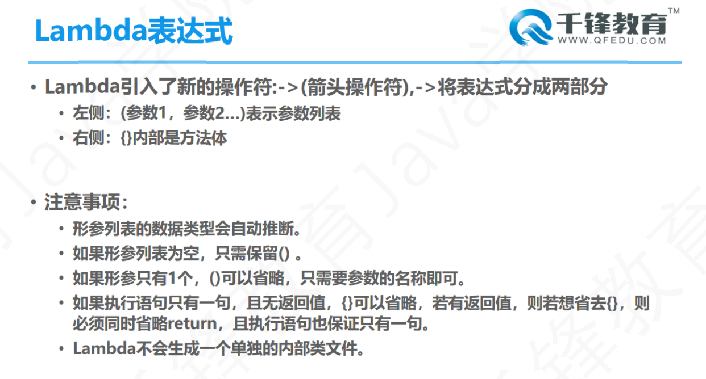

# Day 22笔记

## 一、网络编程

### 1.1 概述

* 网络：为实现资源共享和信息传递，通过通信线路连接起来的若干主机
* 网络编程：让计算机与计算机之间建立连接，进行通信
  * OSI：开放式系统互联（Oper System Internetconnection）
* TCP/IP :TCP/IP模型，一组用于实现网络互联的通讯协议，将协议分为四个层次
* TCP:Transmission control protocol
  * TCP传输控制协议：面向传输可靠的基于字节流的协议，数据大小无限制，连接需要三次握手，断开连接需要4次挥手
* UDP：User datagram protocol
  * UDP用户数据报协议：无连接的传输层协议，面向事务的简单不可靠传输，单次传输数据包大小64KB
* IP：Internet protocol address
* Port：端口号，通信实体上进行网络通信的程序的唯一标识号

## 二、InetAddress

### 2.1 概述

* 此类表示互联网协议 (IP) 地址。  
* IP 地址是 IP 使用的 32 位或 128 位无符号数字，它是一种低级协议，UDP 和 TCP 协议都是在它的基础上构建的。

### 2.2 创建对象

```java
package com.qf.inet;

import java.net.InetAddress;
import java.net.UnknownHostException;

public class Demo01 {
	public static void main(String[] args) throws UnknownHostException {
		/**
		static InetAddress getLocalHost() 
		返回本地主机。 
			static InetAddress[] getAllByName(String host) 
			          在给定主机名的情况下，根据系统上配置的名称服务返回其 IP 地址所组成的数组。
			static InetAddress getByName(String host) 
			          在给定主机名的情况下确定主机的 IP 地址。 
			          
			String getCanonicalHostName() 
			          获取此 IP 地址的完全限定域名。 
			String getHostAddress() 
			          返回 IP 地址字符串（以文本表现形式）。 
			String getHostName() 
			          获取此 IP 地址的主机名。 
		 *  byte[] getAddress() 
			          返回此 InetAddress 对象的原始 IP 地址。 
		 */
		
		// 获取当前主机的主机名和地址
		InetAddress address01 = InetAddress.getLocalHost();
		System.out.println(address01);
		
		System.out.println(address01.getHostAddress());
		System.out.println(address01.getHostName());
		
		InetAddress address02 = InetAddress.getByName("www.baidu.com");
		System.out.println(address02);
		
		InetAddress[] addresses = InetAddress.getAllByName("www.baidu.com");
		for (InetAddress inetAddress : addresses) {
			System.out.println(inetAddress);
		}
	}
}
```

## 三、发送消息

### 3.1 服务端

```java
package com.qf.tcp0;

import java.io.BufferedReader;
import java.io.IOException;
import java.io.InputStream;
import java.io.InputStreamReader;
import java.net.ServerSocket;
import java.net.Socket;

/**
 * 1、创建ServerSocket,明确服务端端口号
 * 2、调用accept方法接收请求
 * 3、获取输入流,读取客户端发来的数据
 * 4、输出数据
 * 5、回复数据--输出流
 * 6、关闭连接
 * @author Dushine2008
 *
 */
public class TcpServer {

	public static void main(String[] args) throws IOException {
		// 1、创建ServerSocket,明确服务端端口号
		ServerSocket serverSocket = new ServerSocket(5678);
		
		// 2、调用accept方法接收请求
		Socket socket = serverSocket.accept();
		
		// 3、获取输入流,读取客户端发来的数据
		InputStream is = socket.getInputStream();
		BufferedReader reader = new BufferedReader(new InputStreamReader(is, "utf-8"));
		
		// 4、输出数据
		String msg = reader.readLine();
		System.out.println(socket.getInetAddress().getHostAddress() + "发来消息:" + msg);
		
		// 6、关闭连接
		serverSocket.close();
	}

}
```

### 3.2 客户端

```java
package com.qf.tcp0;

import java.io.BufferedWriter;
import java.io.IOException;
import java.io.OutputStream;
import java.io.OutputStreamWriter;
import java.net.Socket;
import java.net.UnknownHostException;

/**
 * 1、创建Socket对象,指明IP和Port
 * 2、获取输出流
 * 3、发送数据
 * 4、接收回复
 * 5、关闭
 * @author Dushine2008
 *
 */
public class TcpClient {

	public static void main(String[] args) throws UnknownHostException, IOException {
		// 1、创建Socket对象,指明IP和Port
		Socket socket = new Socket("10.31.154.53", 5678);
		
		// 2、获取输出流
		OutputStream os = socket.getOutputStream();
		BufferedWriter writer = new BufferedWriter(new OutputStreamWriter(os, "utf-8"));
		
		// 3、发送数据
		writer.write("唧唧复唧唧");
		writer.flush();
		// 5、关闭
		socket.close();
		
	}

}
```

## 四、文件上传

### 4.1 服务端

```java
package com.qf.tcp02;

import java.io.File;
import java.io.FileOutputStream;
import java.io.IOException;
import java.io.InputStream;
import java.net.ServerSocket;
import java.net.Socket;

/**
 * 1、创建ServerSocket对象
 * 2、调用accept方法获取Socket对象
 * 3、获取输入流
 * 4、创建输出流--把读取的文件数据写到本地
 * 5、循环读写
 * 6、关闭连接
 * @author Dushine2008
 *
 */
public class TcpServer {
	public static void main(String[] args) throws IOException {
		// 1、创建ServerSocket对象
		ServerSocket serverSocket = new ServerSocket(6789);
		
		// 2、调用accept方法获取Socket对象
		Socket socket = serverSocket.accept();
		
		// 3、获取输入流
		InputStream is = socket.getInputStream();
		
		// 4、创建输出流--把读取的文件数据写到本地
		FileOutputStream fos = new FileOutputStream(new File("img001.jpg"));
		
		//  5、循环读写
		byte[] b = new byte[1024];
		int len = -1;
		
		while ((len=is.read(b)) != -1) {
			fos.write(b, 0, len);
		}
		
		// 6、关闭连接
		System.out.println("文件接收完成...");
		fos.close();
		serverSocket.close();
		
	}
}
```

### 4.2 客户端

```java
package com.qf.tcp02;

import java.io.File;
import java.io.FileInputStream;
import java.io.IOException;
import java.io.OutputStream;
import java.net.Socket;
import java.net.UnknownHostException;

/**
 * 1、创建Socket对象
 * 2、创建输入流
 * 3、获取输出流
 * 4、读写数据
 * 5、关闭连接
 * @author Dushine2008
 *
 */
public class TcpClient {
	public static void main(String[] args) throws UnknownHostException, IOException {
		// 1、创建Socket对象
		Socket socket = new Socket("10.31.154.53", 6789);
		
		// 2、创建输入流
		FileInputStream fis = new FileInputStream(new File("D:\\img001.jpg"));
		
		// 3、获取输出流
		OutputStream os = socket.getOutputStream();
		
		// 4、读写数据
		byte[] b = new byte[1024];
		int len = -1;
		
		while ((len = fis.read(b)) != -1) {
			os.write(b, 0, len);
		}
		
		// 5、关闭连接
		System.out.println("上传完成...");
		fis.close();
		socket.close();
	}
}

```

## 五、文件上传和文件名

### 5.1 服务端

```java
package com.qf.tcp1;

import java.io.File;
import java.io.FileOutputStream;
import java.io.IOException;
import java.io.InputStream;
import java.net.ServerSocket;
import java.net.Socket;

public class TcpServer {
	public static void main(String[] args) throws IOException {
		// 1、创建ServerSocket对象
		ServerSocket serverSocket = new ServerSocket(6677);
		
		// 2、调用accept方法获取Socket对象
		Socket socket = serverSocket.accept();
		
		// 3、获取输入流
		InputStream is = socket.getInputStream();
		
		// 4、读取文件名字
		byte[] bytes = new byte[256];
		is.read(bytes);
		
		// bytes转换成字符串
		String fileName = new String(bytes);
		fileName = "C:\\Users\\Dushine2008\\Desktop\\" + fileName.trim();
		
		// 创建文件对象
		File file = new File(fileName);
		
		// 5、创建输出流
		FileOutputStream fos = new FileOutputStream(file);
		
		// 6、循环读写
		byte[] b = new byte[1024];
		int len = -1;
		
		while ((len = is.read(b)) != -1) {
			fos.write(b, 0, len);
		}
		System.out.println("文件接收成功....................");
		
		fos.close();
		serverSocket.close();
	}
}
```

### 5.2 客户端

```java
package com.qf.tcp1;

import java.io.ByteArrayInputStream;
import java.io.File;
import java.io.FileInputStream;
import java.io.IOException;
import java.io.OutputStream;
import java.io.SequenceInputStream;
import java.net.Socket;
import java.net.UnknownHostException;
import java.util.Arrays;

/**
 * 1、创建Socket对象
 * 2、创建输入流--准备文件信息
 * 3、获取输出流--输出文件信息
 * 4、文件信息和文件数据合并发送
 * 5、读写数据
 * 6、关闭连接
 * @author Dushine2008
 *
 */
public class TcpClient {
	public static void main(String[] args) throws UnknownHostException, IOException {
		// 1、创建Socket对象
		Socket socket = new Socket("10.31.154.53", 6677);
		
		// 2、创建输入流--准备文件信息
		File file = new File("D:/threeCountry.txt");
		FileInputStream fis = new FileInputStream(file);
		
		// 3、获取输出流--输出文件信息
		OutputStream os = socket.getOutputStream();
		
		// 获取文件名字的字节数组
		byte[] bs = file.getName().getBytes();
		
		// 确定每一个数组的长度都是256
		byte[] bytes = Arrays.copyOf(bs, 256);
		
		// 4、文件信息和文件数据合并发送
		ByteArrayInputStream bais = new ByteArrayInputStream(bytes);
		SequenceInputStream sis = new SequenceInputStream(bais, fis);
		
		// 5、读写数据
		byte[] b = new byte[1024];
		int len = -1;
		
		while ((len = sis.read(b)) != -1) {
			os.write(b, 0, len);
		}
		System.out.println("文件上传成功...");
		fis.close();
		socket.close();
	}
}
```

## 六、Lambda

### 6.1 概述

* JDK8发布时间是2014年
* 增加了一些新的内容
  * Lambda表达式
  * 函数式接口
  * 新的时间API
  * Stream
  * ... ...

### 6.2 lambda表达式

* 简化匿名内部类创建过程
* 引入了新的运算符     ->

```
接口声明   对象名   =    方法的参数列表   ->   方法体
```

* 接口声明必须是函数式接口

### 6.3 简化线程创建

```java
package com.qf.lambda;

/**
 * 	简化创建线程
 * @author Dushine2008
 *
 */
public class Demo01 {
	public static void main(String[] args) {
		MyRunnable r1 = new MyRunnable();
		Thread t1 = new Thread(r1);
		t1.start();
		
		Runnable r2 = new Runnable() {
			public void run() {
				System.out.println("线程02启动....");
			}
		};
		Thread t2 = new Thread(r2);
		t2.start();
		
		Runnable r3 = () -> {
			System.out.println("线程03启动....");
		};
		Thread t3 = new Thread(r3);
		t3.start();
		
		Runnable r4 = () -> System.out.println("线程04启动....");
		Thread t4 = new Thread(r4);
		t4.start();
		
		Thread t5 = new Thread(() -> System.out.println("线程05启动...."));
		t5.start();
		
		new Thread(() -> System.out.println("线程06启动....")).start();
	}
}

class MyRunnable implements Runnable{

	@Override
	public void run() {
		System.out.println("线程01启动...");
	}
	
}
```

### 6.4 简化比较器创建

```java
package com.qf.lambda;

import java.util.Comparator;
import java.util.TreeSet;

public class Demo02 {
	public static void main(String[] args) {
		// 创建比较器对象,字符长的放后面
		Comparator<String> c1 = new Comparator<String>() {
			@Override
			public int compare(String s1, String s2) {
				return s1.length() - s2.length();
			}
		};
		TreeSet<String> s1 = new TreeSet<String>(c1);
		s1.add("hello");
		s1.add("haha");
		s1.add("hi");
		s1.add("heiheihei");
		s1.add("houhou");
		s1.add("xixixixi");
		System.out.println(s1);
		
		/**
		 * 	方法的参数列表 -> 方法体
		 */
		Comparator<String> c2 = (String s01, String s02) -> {
			return s01.length() - s02.length();
		};
		TreeSet<String> s2 = new TreeSet<String>(c2);
		s2.add("hello");
		s2.add("haha");
		s2.add("hi");
		s2.add("heiheihei");
		s2.add("houhou");
		s2.add("xixixixi");
		System.out.println(s2);
		
		Comparator<String> c3 = (s01, s02) -> {
			return s01.length() - s02.length();
		};
		TreeSet<String> s3 = new TreeSet<String>(c3);
		s3.add("hello");
		s3.add("haha");
		s3.add("hi");
		s3.add("heiheihei");
		s3.add("houhou");
		s3.add("xixixixi");
		System.out.println(s3);
		
		Comparator<String> c4 = (s01, s02) -> s01.length() - s02.length();
		TreeSet<String> s4 = new TreeSet<String>(c4);
		s4.add("hello");
		s4.add("haha");
		s4.add("hi");
		s4.add("heiheihei");
		s4.add("houhou");
		s4.add("xixixixi");
		System.out.println(s4);
		
		TreeSet<String> s5 = new TreeSet<String>((s01, s02) -> s01.length() - s02.length());
		s5.add("hello");
		s5.add("haha");
		s5.add("hi");
		s5.add("heiheihei");
		s5.add("houhou");
		s5.add("xixixixi");
		System.out.println(s5);
		
		TreeSet<String> s6 = new TreeSet<String>(String::compareTo);
		s6.add("hello");
		s6.add("haha");
		s6.add("hi");
		s6.add("heiheihei");
		s6.add("houhou");
		s6.add("xixixixi");
		System.out.println(s6);
	}
}
```

### 6.5 Lambda特点



## 七、函数型接口

### 7.1 概述

* 接口，接口中只能有一个抽象方法
* 可以使用注解标记
  * @functionalinterface

### 7.2 自定义函数型接口

```java
package com.qf.lambda;

public class Demo03 {
	public static void main(String[] args) {
		USB u1 = new USB() {
			@Override
			public void charge() {
				System.out.println("USB具有充电功能...");
			}
		};
		u1.charge();
		
		USB u2 = () -> System.out.println("USB接口真的能充电");
		u2.charge();
	}
}

@FunctionalInterface
interface USB{
	void charge();
	// void transfer();
}
```

### 7.3 自定义函数型接口

```java
package com.qf.lambda;

public class Demo04 {
	public static void main(String[] args) {
		Sum s1 = new Sum() {
			@Override
			public int getSum(int a, int b) {
				return a+b;
			}
		};
		int sum01 = s1.getSum(33, 55);
		System.out.println(sum01);
		
		Sum s2 = (a,b) -> a+b;
		int sum02 = s2.getSum(33, 55);
		System.out.println(sum02);
	}
}

/**
 * 	函数型接口
 * @author Dushine2008
 *
 */
@FunctionalInterface
interface Sum{
	int getSum(int a,int b);
}
```

### 7.4 消费型函数接口

```java
package com.qf.lambda;

import java.util.function.Consumer;

public class Demo05 {
	public static void main(String[] args) {
		Consumer<Integer> c1 = new Consumer<Integer>() {
			@Override
			public void accept(Integer t) {
				System.out.println("周末出去happy一下,预算:" + t);
			}
		};
		c1.accept(200);
		
		Consumer<Integer> c2 = t -> System.out.println("周末出去happy一下,预算:" + t);
		c2.accept(210);
		
		play(c1, 230);
		
		play(t -> System.out.println("周末出去happy一下,预算:" + t), 330);
		
	}
	
	/**
	 * 	消费型接口
	 * @param consumer
	 * @param money
	 */
	public static void play(Consumer<Integer> consumer,Integer money) {
		consumer.accept(money);
	}
	
}
```

### 7.5 供给型函数接口

```java
package com.qf.lambda;

import java.util.Arrays;
import java.util.Random;
import java.util.function.Supplier;

public class Demo06 {
	public static void main(String[] args) {
		Supplier<Integer> s1 = new Supplier<Integer>() {
			@Override
			public Integer get() {
				return new Random().nextInt(100);
			}
		};
		
		for (int i = 0; i < 10; i++) {
			System.out.println(s1.get());
		}
		
		System.out.println("=================");
		
		Supplier<Integer> s2 = () -> new Random().nextInt(100);
		for (int i = 0; i < 10; i++) {
			System.out.println(s2.get());
		}
		
		System.out.println("=================");
		
		int[] arr = getArr(() -> new Random().nextInt(100), 10);
		System.out.println(Arrays.toString(arr));
		
	}
	
	/**
	 * 	返回指定长度的随机数数组
	 * @param supplier	提供随机数
	 * @param num		指定数量
	 * @return			数组
	 */
	public static int[] getArr(Supplier<Integer> supplier,int num) {
		int[] arr = new int[num];
		for (int i = 0; i < arr.length; i++) {
			arr[i] = supplier.get();
		}
		return arr;
	}
}
```

### 7.6 函数型接口

```java
package com.qf.lambda;

import java.util.function.Function;

public class Demo07 {
	public static void main(String[] args) {
		Function<String, Character> f1 = new Function<String, Character>() {
			@Override
			public Character apply(String str) {
				return str.charAt(0);
			}
		};
		Character c1 = f1.apply("张三");
		System.out.println(c1);
		
		Function<String, Character> f2 = str -> str.charAt(0);
		System.out.println(f2.apply("李四"));
		
		Character c3 = getFamilyName(f2, "王五");
		System.out.println(c3);
	}
	
	/**
	 * 	函数型接口
	 * @param function	定义操作数据的规则
	 * @param name		被操作的数据
	 * @return			返回的结果
	 */
	public static Character getFamilyName(Function<String, Character> function,String name) {
		return function.apply(name);
	}
	
}
```

### 7.7 断言型接口

```java
package com.qf.lambda;

import java.util.ArrayList;
import java.util.List;
import java.util.function.Predicate;

public class Demo08 {
	public static void main(String[] args) {
		Predicate<String> p1 = new Predicate<String>() {
			@Override
			public boolean test(String t) {
				return t.startsWith("张");
			}
		};
		boolean b1 = p1.test("张三");
		System.out.println(b1);
		
		Predicate<String> p2 = str -> str.startsWith("张");
		System.out.println(p2.test("李四"));
		
		ArrayList<String> names = new ArrayList<String>();
		names.add("张三");
		names.add("李四");
		names.add("张武");
		names.add("赵柳");
		
		List<String> list = filterName(p2, names);
		System.out.println(list);
		
	}
	
	/**
	 * 	断言型接口
	 * @param predicate	判断的规则
	 * @param names		被判断的所有数据
	 * @return			符合规则的数据
	 */
	public static List<String> filterName(Predicate<String> predicate,List<String> names){
		ArrayList<String> list = new ArrayList<String>();
		// 判断
		for (String name : names) {
			if (predicate.test(name)) {
				list.add(name);
			}
		}
		return list;
	}	
}
```

## 八、方法引用

### 8.1 概述

* 对Lambda表达式进行再次简化
* 常见形式
  * 对象::实例方法
  * 类::静态方法
  * 类::new

### 8.2 案例

```java
package com.qf.lambda;

import java.util.function.Consumer;
import java.util.function.Supplier;

public class Demo09 {
	public static void main(String[] args) {
		Consumer<String> c1 = new Consumer<String>() {
			@Override
			public void accept(String t) {
				System.out.println("输出:" + t);
			}
		};
		c1.accept("Hello");
		
		Consumer<String> c2 = str -> System.out.println("输出:" + str);
		c2.accept("World");
		
		// 实例::实例方法
		Consumer<String> c3 = System.out::println;
		c3.accept("HelloWorld");
		
		// 类::静态方法
		Consumer<String> c4 = Employee::showStatic;
		c4.accept("haha");
		
		// 实例::实例方法
		Consumer<String> c5 = new Employee()::show;
		c5.accept("hehe");
		
		Supplier<Employee> s = Employee::new;
		Employee e = s.get();
		System.out.println(e);
	}
}
```

