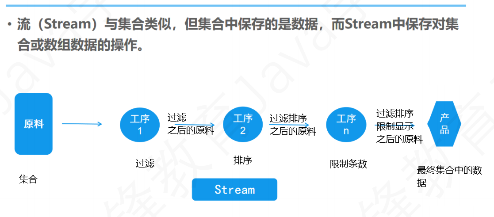

# Day23笔记

## 一、Stream

### 1.1 概述

* 集合中存储的是数据
* 流中存储的是对数据的各种操作



### 1.2 Stream特点

* 不存储元素，存储操作
* 不直接产生对象结果，产生新的Stream
* 操作是延迟执行的，会等到需要结果的时候才会执行

### 1.3 创建Stream对象

```java
package com.qf.stream;

import java.util.ArrayList;
import java.util.Arrays;
import java.util.stream.IntStream;
import java.util.stream.Stream;

public class Demo01 {
	public static void main(String[] args) {
		ArrayList<Employee> list = new ArrayList<Employee>();
		list.add(new Employee("张三", 12000));
		list.add(new Employee("李四", 11000));
		list.add(new Employee("王五", 15000));
		list.add(new Employee("赵柳", 19000));
		list.add(new Employee("田七", 10000));
		System.out.println(list);
		
		// 使用Collection对象生成Stream
		Stream<Employee> s1 = list.stream();
		System.out.println(s1);
		s1.forEach(System.out::println);
		System.out.println("============================================");
		
		list.stream().forEach(System.out::println);
		System.out.println("============================================");
		
		// 使用Arrays的方法生成Stream
		Arrays.stream(new int[] {111,222,333}).forEach(System.out::println);
		System.out.println("============================================");
		
		// 使用Stream自带的方法生成Stream
		Stream.of("张三","李四","王五").forEach(System.out::println);
		System.out.println("============================================");
		
		// 使用IntStream、LongStream、DoubleStream生成
		IntStream.of(123,234,345).forEach(System.out::println);
		
	}
}
```

### 1.4 中间操作

```java
package com.qf.stream;

import java.util.ArrayList;
import java.util.stream.Stream;

public class Demo02 {
	public static void main(String[] args) {
		ArrayList<Employee> list = new ArrayList<Employee>();
		list.add(new Employee("张三", 12000));
		list.add(new Employee("李四", 11000));
		list.add(new Employee("王五", 15000));
		list.add(new Employee("赵柳", 19000));
		list.add(new Employee("田七", 10000));
		list.add(new Employee("田七", 10000));
		System.out.println(list);
		
		System.out.println("==================filter======================");
		Stream<Employee> s1 = list.stream();
		// Stream每次中间操作不产生结果，不结束，产生一个新的Stream
		Stream<Employee> s11 = s1.filter((e -> e.getSalary()>12000));
		// 终止操作
		s11.forEach(System.out::println);
		System.out.println("==================filter======================");
		list.stream().filter((e -> e.getSalary()>12000)).forEach(System.out::println);
		
		System.out.println("==================limit======================");
		list.stream().limit(3).forEach(System.out::println);
		
		System.out.println("==================skip======================");
		list.stream().skip(3).forEach(System.out::println);
		
		System.out.println("==================distinct======================");
		list.stream().distinct().forEach(System.out::println);
		
		System.out.println("==================sorted======================");
		list.stream().sorted((e1,e2) -> Double.compare(e1.getSalary(), e2.getSalary())).forEach(System.out::println);
		
		System.out.println("==================map======================");
		list.stream().map(e -> e.getName()).forEach(System.out::println);
		
	}
}
```

### 1.5 终止操作

```java
package com.qf.stream;

import java.util.ArrayList;
import java.util.List;
import java.util.Optional;
import java.util.stream.Collectors;

public class Demo03 {
	public static void main(String[] args) {
		ArrayList<Employee> list = new ArrayList<Employee>();
		list.add(new Employee("张三", 12000));
		list.add(new Employee("李四", 11000));
		list.add(new Employee("王五", 15000));
		list.add(new Employee("赵柳", 19000));
		list.add(new Employee("田七", 10000));
		list.add(new Employee("田七", 10000));
		System.out.println(list);
		
		System.out.println("==================foreach===================");
		list.stream().forEach(System.out::println);
		
		System.out.println("==================min===================");
		Optional<Employee> min = list.stream().min((e1,e2) -> Double.compare(e1.getSalary(), e2.getSalary()));
		System.out.println(min);
		
		System.out.println("==================max===================");
		Optional<Employee> max = list.stream().max((e1,e2) -> Double.compare(e1.getSalary(), e2.getSalary()));
		System.out.println(max);
		
		System.out.println("==================count===================");
		long count = list.stream().filter((e -> e.getSalary()>12000)).count();
		System.out.println(count);
		
		System.out.println("==================reduce===================");
		Optional<Double> reduce = list.stream().map(e -> e.getSalary()).reduce((x,y) -> x+y);
		System.out.println(reduce);
		
		System.out.println("==================collect===================");
		List<String> collect = list.stream().map(e -> e.getName()).collect(Collectors.toList());
		System.out.println(collect);
		
	}
}
```

## 二、新的时间API

### 2.1 概述

* 老版本的时间API
  * 创建方式各异
  * 修改方式不同
  * 可能出现线程安全问题
* 新的时间API
  * 创建方式相同
  * 获取方式相同
  * 设置方式相同

### 2.2 LocalDate

* `LocalDate`是一个不可变的日期时间对象，表示日期，通常被视为年月日。  
* 也可以访问其他日期字段，例如日期，星期几和星期。

```java
package com.qf.time;

import java.time.LocalDate;

public class Demo02 {
	public static void main(String[] args) {
		LocalDate localDate = LocalDate.now();
		System.out.println(localDate);
		
		LocalDate localDate2 = LocalDate.of(2021, 5, 20);
		System.out.println(localDate2);
		
		// 获取年月日
		System.out.println(localDate.getYear());
		System.out.println(localDate.getMonth());
		System.out.println(localDate.getDayOfMonth());
		
		// 修改年月日
		LocalDate localDate3 = localDate.plusYears(-3).plusMonths(-3).plusDays(-3);
		System.out.println(localDate3);
		
	}
}
```

### 2.3 LocalTime

```java
package com.qf.time;

import java.time.LocalTime;

public class Demo03 {
	public static void main(String[] args) {
		// 创建LocalTime对象
		LocalTime localTime = LocalTime.now();
		System.out.println(localTime);
		
		// 获取时分秒
		System.out.println(localTime.getHour());
		System.out.println(localTime.getMinute());
		System.out.println(localTime.getSecond());
		
		// 设置时分秒
		LocalTime localTime2 = localTime.plusHours(-2).plusMinutes(-20).plusSeconds(-20);
		System.out.println(localTime2);
	
	}
}
```

### 2.4 LocalDateTime

```java
package com.qf.time;

import java.time.LocalDateTime;

public class Demo04 {
	public static void main(String[] args) {
		// 创建对象
		LocalDateTime localDateTime = LocalDateTime.now();
		System.out.println(localDateTime);
		
		// 获取年月日时分秒
		System.out.println(localDateTime.getYear());
		System.out.println(localDateTime.getMonth());
		System.out.println(localDateTime.getDayOfMonth());
		System.out.println(localDateTime.getHour());
		System.out.println(localDateTime.getMinute());
		System.out.println(localDateTime.getSecond());
		
		// 设置年月日时分秒
		LocalDateTime plusDays = localDateTime.plusYears(-2).plusMonths(-2).plusDays(-2);
		System.out.println(plusDays);
	}
}
```

### 2.5 Instant

* 时间戳
* 默认是格林威治时间

```java
package com.qf.time;

import java.time.Clock;
import java.time.Instant;
import java.time.ZoneId;
import java.time.ZonedDateTime;
import java.util.Set;

public class Demo05 {
	public static void main(String[] args) {
		// 唯一的时间戳--准
		Instant instant = Instant.now();
		System.out.println(instant);
		
		Instant now = Instant.now(Clock.system(ZoneId.systemDefault()));
		System.out.println(now);
		
		Instant instant2 = Instant.ofEpochMilli(System.currentTimeMillis());
		System.out.println(instant2);
		
		Set<String> zoneIds = ZoneId.getAvailableZoneIds();
		for (String zoneId : zoneIds) {
			System.out.println(zoneId);
		}
		
		Instant instant3 = Instant.now(Clock.system(ZoneId.of("Asia/Shanghai")));
		System.out.println(instant3);
		
		// 将此瞬间与时区相结合，创建一个 ZonedDateTime 。 
		ZonedDateTime zone = instant.atZone(ZoneId.systemDefault());
		System.out.println(zone);
		
	}
}
```

### 2.6 ZoneId

* 时区

### 2.7 DateTimeFormatter

```java
package com.qf.time;

import java.time.LocalDate;
import java.time.format.DateTimeFormatter;

public class Demo06 {
	public static void main(String[] args) {
		// 创建格式化工具
		DateTimeFormatter formatter = DateTimeFormatter.ofPattern("yyyy-MM-dd");
		
		// 字符串===》LocalDate对象
		LocalDate date = LocalDate.parse("1990-12-30", formatter);
		System.out.println(date);
		
		// LocalDate对象===》字符串
		String time = formatter.format(LocalDate.now());
		System.out.println(time);
		
	}
}
```

